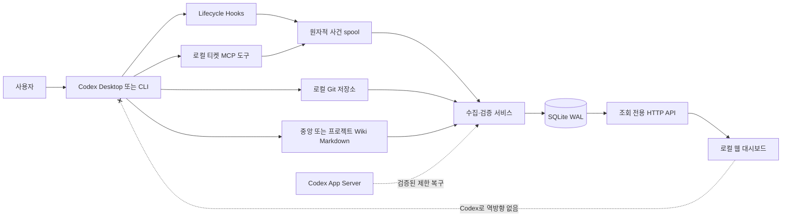
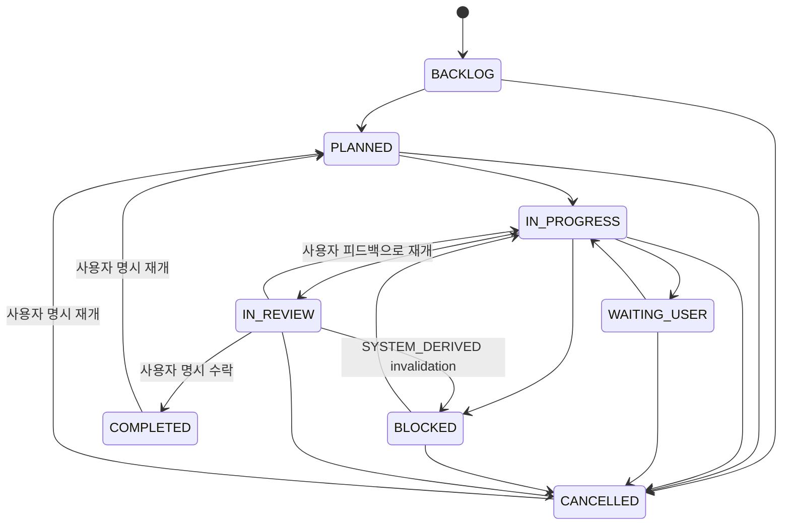

# Codex 작업 티켓 대시보드 프로토타입 상세 설계서 v1.3

- 문서 상태: `DETAILED-DESIGN-V1.3-USER-ACCEPTED / MCP-FIRST-DESKTOP-EXECUTION-AUTHORIZED / MCP-FIRST-DESKTOP-CANDIDATE-USER-ACCEPTED / DESKTOP-SCOPE-COMPLETED / FULL-V1.3-NOT-COMPLETED`
- 작성일: 2026-09-01 KST
- 대상 환경: Windows, `C:\MyProject`, Codex Desktop·CLI
- 계획 제품명: `codex-ticket-dashboard`
- 계획 플러그인명: `codex-ticket-observer`
- 기준 문서: `wiki/knowledge/14 Codex 작업 티켓 추적 도구 선택.md`

## 1. 작업 패킷

```text
Task: Codex 작업 티켓 대시보드 프로토타입 상세 설계와 v1.2·v1.3 승인 수정안 통합
Owner project: C:\MyProject\codex-ticket-dashboard (등록된 로컬 프로젝트 경로, 구현 파일 없음)
Goal: Codex 프로젝트·스레드·Task·Subtask·피드백·결과·상태와 Git·Wiki 준수 여부를 자동 수집해 로컬 조회 전용 웹에서 추적하는 프로토타입의 구현 계약을 확정하고, 식별·권한·정책·사건 dependency·요약 전용 개인정보·안정 목록·Windows 로컬 보안 누락을 닫는다.
Non-goals: 실제 코드 구현, Hooks 설치, 플러그인 설치, 서비스 실행, 기존 스레드 전체 이관, 웹 편집, GitHub·Slack·Jira·Linear·Notion 연동, 자동 commit·push, Hook의 Wiki 자동 쓰기.
User-visible behavior: 사용자는 Codex에서만 일하고, 웹에서는 자동 생성된 프로젝트·티켓·Task·상태·타임라인·Git·Wiki 준수 상태를 조회한다.
Files allowed: docs/design-codex-ticket-dashboard-prototype-v1-20260901.md, docs/design-codex-ticket-dashboard-prototype-v1.2-amendment-20260901.md, docs/design-codex-ticket-dashboard-prototype-v1.3-amendment-20260901.md와 승인된 task evidence. Wiki·Phase 0 패킷·AGENTS는 별도 Todo 소유다.
Files excluded: 기존 프로젝트 소스, Codex config, Hooks, plugin cache, 계정·자격증명, 세션 원문, 실제 서비스 파일.
Required context: OpenAI Hooks, Codex App Server, C:\MyProject Wiki-first·검증·Git 권한 규칙.
Acceptance criteria: 구성·권한·이벤트·ID·DB·상태·준수 게이트·API·화면·복구·보안·검증·단계별 인계가 구현 가능한 수준으로 정의된다.
Change class: 설계 문서와 Wiki 인계만 변경하는 문서 작업.
Observed change surface: 상세 설계 문서와 기존 지식 문서의 설계 링크·상태·리뷰 통합 기록.
Risk boundary: 논리 프로젝트와 상위 Git 저장소의 식별 충돌, 미해결 프로젝트 사건 유실, 부모·자식 사건 역전, Codex 완료와 사용자 수락 혼동, 사용자 결정 재사용, 정책 mismatch·drift, Stop의 거짓 누락, 작업 자동 분류 누락, Git 권한 확대, Wiki 자동 쓰기, 비밀값 기록, 역방향 Codex 제어, 불안정한 세션 원문 의존.
Expected verification value: 필수 절·상태·도구·테이블·API·검증 시나리오 존재, 내부 용어 정합성, 링크, 엄격한 UTF-8을 확인하면 문서 완료 여부를 결정할 수 있다.
Estimated verification cost: 테스트·빌드·브라우저·별도 에이전트 0, 문서 정적 검사 3종과 Company Memory Guardian 1회.
Escalation trigger: 실제 코드·설정·Hook·plugin·서비스를 변경하거나 합성 프로젝트 호환성 시험을 시작할 때 별도 구현 작업 패킷으로 재분류한다.
Verification commands: rg 필수 표식 검사, Markdown 링크·절 정합성 검사, strict UTF-8 decode, Company Memory Guardian 완료 manifest 검증.
Verification gates: 문서 내용·UTF-8 required, 코드 테스트·빌드·UI QA·배포·보안 실행 not-applicable.
Security/privacy notes: transcript 원문·prompt 원문·비밀값·쿠키·token·자격증명은 문서와 증거에 기록하지 않는다.
Generated artifacts: 없음.
Git dirty-state note: MyProject와 Wiki는 작업 전부터 다른 변경이 존재한다. 지정 문서 외 파일을 되돌리거나 stage·commit·push하지 않는다.
Handoff location: 이 문서와 wiki/knowledge/14 Codex 작업 티켓 추적 도구 선택.md.
```

## 2. 목표와 성공 기준

### 2.1 목표

사용자는 작업 지시, 피드백, 완료 승인까지 Codex에서만 수행한다. 시스템은 Codex 작업을 관찰해 다음 정보를 자동으로 웹 티켓에 투영한다.

- 프로젝트와 Git worktree 관계
- Codex 스레드와 대화 회차
- 업무 티켓, Task, Subtask
- 사용자 요구·피드백 요약
- Codex 결과·검증·차단·다음 단계
- 작업 상태와 상태 전이 이유
- Git 업데이트 준수
- Obsidian Wiki 업데이트 준수
- 기록 누락과 복구 상태

### 2.2 프로토타입 성공 기준

1. 새 Codex 스레드가 별도 사용자 입력 없이 수집 기록으로 생성된다.
2. 명확한 작업은 신규 또는 기존 업무 티켓에 연결되고 여러 Task·Subtask를 가질 수 있다.
3. 사용자 피드백과 Codex 최종 결과가 같은 `turn_id`로 연결된다.
4. 분류에 실패한 활동은 사라지지 않고 `UNCLASSIFIED`로 표시된다.
5. 결과 보고 시 상태, Git 게이트, Wiki 게이트와 다음 단계가 함께 갱신된다.
6. 수집기가 중단돼도 로컬 spool에 쌓인 사건이 재시작 뒤 중복 없이 반영된다.
7. 브라우저에는 Codex를 제어하거나 티켓을 수정하는 endpoint가 없다.
8. 서비스가 없어도 Codex 작업 자체는 계속 가능하며 기록 누락이 명시적으로 드러난다.
9. 비밀값과 사용자 prompt·assistant message·transcript·Hook 출력의 원문 또는 발췌를 저장하지 않는다.

## 3. 확정 결정

| 항목 | 결정 |
| --- | --- |
| 작업 원본 | Codex Desktop·CLI의 lifecycle 사건과 구조화 기록 도구 |
| 웹 역할 | 로컬 조회 전용 dashboard |
| 연동 방향 | Codex → 티켓 저장소 → 웹. 웹 → Codex 경로 없음 |
| 저장소 | 로컬 SQLite WAL |
| 실시간 수집 | Codex Hooks |
| 누락 복구 | 검증된 경우에만 Codex App Server `thread/list`, `thread/read` |
| App Server 조회 | `thread/list`는 `useStateDbOnly=true`와 명시적 `sourceKinds`, `thread/read`는 기본 `includeTurns=false` |
| Task 식별 | Codex의 명시적 `task_upsert`, plan·subagent는 보조 근거 |
| 결과 요약 | 현재 작업 중인 Codex가 `ticket_turn_summary`로 기록 |
| 개인정보 (승인 결정 `1A`) | 구조화 summary와 제한된 source metadata만 저장. prompt·assistant message·transcript·Hook 출력의 원문 또는 발췌는 저장하지 않음 |
| 상태 완료 권한 | Codex 결과는 `IN_REVIEW`까지, `COMPLETED`는 사용자 명시 수락 |
| 프로젝트 식별 | 논리 Codex 프로젝트 ID와 Git 저장소 `repo_key`를 분리. Git common dir만으로 프로젝트를 합치지 않음 |
| 미해결 프로젝트 | `project_observation_id`로 격리하고 식별 완료 전 정상 project projection에 넣지 않음 |
| 사건 순서 | watcher 발견 순서가 아니라 `depends_on_event_ids`와 pending dependency로 projection 순서를 보장 |
| 목록 일관성 (승인 결정 `2A`) | 불변 `created_seq`·`ingest_seq`와 첫 page `snapshot_high_watermark` 사용 |
| 사용자 결정 근거 | 완료·취소·재개는 구조화된 사용자 결정 사건과 원본 turn 참조가 필수 |
| 정책 판정 | 선언 requirement, 해석 requirement, 실행 권한 상한, policy snapshot을 분리 |
| Git 기본 | Git 상태 증거는 항상 확인. 파일 변경 작업은 설계상 `COMMIT` 요구가 기본이며 실제 commit 권한은 적용된 정책·작업 범위에서 확인. `PUSH`는 명시적 승인만 허용 |
| Wiki 기본 | `C:\MyProject` 작업은 적용 Wiki가 원칙적으로 `REQUIRED` |
| 편집 기능 | P2·P3로 연기. 프로토타입에는 코드·stub·빈 API도 만들지 않음 |
| 외부 SaaS | GitHub·Slack·Jira·Linear·Trello·Notion·클라우드 DB·호스팅 제외 |
| 예약 실행 | 생성하지 않음. 사건 기반 수집과 수동 실행만 설계 |
| 로컬 보안 (승인 결정 `3A`) | owner-only Windows ACL, reparse·UNC·device path 거부, loopback·Host allowlist·`no-store`; 별도 인증 token 없음 |

## 4. 범위와 우선순위

### P0: 원본 수집과 신뢰성

- 현재 Codex Desktop·CLI에서 Hooks 실제 발화 검증
- 프로젝트·스레드·회차 식별
- 스레드 수집 기록과 업무 티켓 연결
- Task·Subtask 등록과 `UNCLASSIFIED`
- 사용자 피드백·결과·상태 구조화
- Git·Wiki 준수 게이트
- 원자적 spool, idempotency, SQLite transaction, 복구
- 비밀값 제거와 payload 크기 제한

### P1: 조회 전용 웹

- 프로젝트 요약
- 상태별 티켓 보드
- 티켓 상세·타임라인·Task 계층
- Git·Wiki 준수 badge와 근거
- 분류 필요·기록 불완전·복구 필요 경고
- 조건부 Codex 원본 링크와 Obsidian 열기 링크

### P2: 운영 후 제한 편집

- 표시 제목, 분류, 라벨, 우선순위, 보충 메모
- `user_edit` 사건과 overlay

### P3: 고복잡도 편집

- 상태 override
- 사용자 인증·권한
- 동시 편집·충돌 해결
- 변경 감사·되돌리기

P2·P3는 프로토타입 비목표다.

## 5. 권한과 원본 계약

### 5.1 권한 계층

| 데이터 | 원본 | 변경 주체 |
| --- | --- | --- |
| 사용자 지시·피드백 | Codex turn | 사용자, Codex 안에서만 입력 |
| 실행 결과·검증·차단 | Codex turn과 구조화 도구 | Codex |
| 일반 Codex 요청 상태 전이 | 구조화 상태 사건 | Codex (`CODEX_PREFLIGHT`·`CODEX_EXECUTION`·`CODEX_RESULT`); Codex가 요청하고 collector가 검증·적용 |
| 정책·준수 무효화의 자동 상태 전이 | 이미 적용된 정책·준수 사건 | collector만 (`actor_type=SYSTEM`, `authority=SYSTEM_DERIVED`); `IN_REVIEW → BLOCKED` 예외는 §13.2·§15.2의 인과·재시도 규칙을 따른다 |
| 사용자 수락·취소 | Codex 사용자 메시지 | 사용자 |
| Git 변경·commit·push | 실제 Git 저장소 | 승인된 Codex 작업 |
| Wiki 내용 | 승인된 중앙 또는 프로젝트 Wiki | Codex 작업 자체 |
| 티켓 현재 화면값 | append-only 사건 projection | 수집기 |
| 웹 편집값 | 프로토타입 없음 | 해당 없음 |

### 5.2 금지 경로

- 웹에서 Codex 스레드 생성·재개·포크·메시지 전송
- 웹에서 Codex 도구·shell·subagent 실행
- 웹에서 승인·완료·취소·보관을 Codex에 전달
- Hook·수집기·웹의 Wiki 자동 쓰기
- observer의 Git commit·push
- transcript JSONL을 안정된 API로 간주해 직접 파싱
- 대화·명령 원문 전체를 티켓 DB에 복제

## 6. 전체 구성



### 6.1 구성요소

| 구성요소 | 책임 | 쓰기 대상 |
| --- | --- | --- |
| `codex-ticket-observer` plugin | Hooks와 MCP 도구 제공, payload 제거·spool append | spool만 |
| Hook command | lifecycle 사건을 짧게 정규화 | spool만 |
| 티켓 MCP server | preflight·Task·summary·status·준수 증거 검증 | spool만 |
| 수집·검증 서비스 | idempotency, 상태 전이, Git·Wiki 근거 대조, projection | SQLite |
| SQLite | 사건·현재값·수집 영수증 | 로컬 파일 |
| 조회 API | 필터링된 조회 model 제공 | 없음 |
| 웹 UI | 프로젝트·티켓·타임라인·준수 상태 표시 | 없음 |
| App Server adapter | 저장 스레드 제한 복구 | SQLite에 복구 사건만 |

## 7. 기술 스택

현재 로컬에서 확인된 기준은 Python 3.12.10, Node.js 24.16.0, Git 2.53.0.windows.2, Codex CLI 0.144.3이다. 프로토타입은 Hook·수집·웹을 한 언어로 유지하기 위해 Python을 선택한다.

| 영역 | 선택 | 이유 |
| --- | --- | --- |
| 언어 | Python 3.12 | Hook script·SQLite·Windows 로컬 서비스 통합 단순화 |
| HTTP | FastAPI + Uvicorn | 명시적 GET route, schema와 health endpoint |
| HTML | Jinja2 server rendering | SPA 상태·빌드 복잡도 축소 |
| 브라우저 동작 | 최소 vanilla JavaScript | 필터·접기·자동 새로고침만 제공 |
| CSS | 로컬 정적 CSS | 외부 CDN·프레임워크 런타임 제거 |
| DB | Python `sqlite3`, WAL | 외부 DB와 자격증명 불필요 |
| migration | 번호가 붙은 순방향 SQL 파일 | Alembic 없이 schema 변화 명시 |
| 테스트 | pytest + FastAPI test client | 수집·상태·API focused test |

FastAPI·Uvicorn·Jinja2·pytest는 구현 시 lock file에 정확한 버전을 고정한다. 프로토타입 설계 문서에서는 최신 버전을 추정하지 않는다.

## 8. 계획 파일 구조

```text
C:\MyProject\codex-ticket-dashboard\
├─ AGENTS.md
├─ README.md
├─ pyproject.toml
├─ requirements.lock
├─ config.example.toml
├─ plugin\
│  ├─ .codex-plugin\plugin.json
│  ├─ hooks\hooks.json
│  ├─ scripts\hook_entry.py
│  └─ skills\ticket-observer\SKILL.md
├─ src\codex_ticket_dashboard\
│  ├─ config.py
│  ├─ domain\
│  │  ├─ enums.py
│  │  ├─ events.py
│  │  ├─ identity.py
│  │  └─ transitions.py
│  ├─ ingest\
│  │  ├─ spool.py
│  │  ├─ collector.py
│  │  ├─ redaction.py
│  │  └─ app_server_adapter.py
│  ├─ mcp\server.py
│  ├─ storage\
│  │  ├─ connection.py
│  │  ├─ repository.py
│  │  └─ migrations\001_initial.sql
│  ├─ compliance\
│  │  ├─ git_gate.py
│  │  └─ wiki_gate.py
│  └─ web\
│     ├─ app.py
│     ├─ queries.py
│     ├─ templates\
│     └─ static\
├─ scripts\
│  ├─ start-local.ps1
│  ├─ stop-local.ps1
│  └─ verify-local.ps1
└─ tests\
   ├─ unit\
   ├─ integration\
   └─ fixtures\synthetic-events\
```

`C:\MyProject`는 Wiki 접근을 위해 구현 스레드의 작업 루트에 포함한다. 새 저장소는 별도 Git root로 만들지 여부를 구현 작업 패킷에서 확정하며, 이번 설계는 디렉터리를 생성하지 않는다.

## 9. 데이터 디렉터리

기본 데이터 경로는 `%LOCALAPPDATA%\CodexTicketDashboard`다. 저장소 checkout이나 worktree 안에 런타임 DB를 두지 않는다.

```text
%LOCALAPPDATA%\CodexTicketDashboard\
├─ config.toml
├─ data\dashboard.db
├─ spool\tmp\
├─ spool\incoming\
├─ spool\pending\identity\
├─ spool\pending\dependency\
├─ spool\dead-letter\
├─ spool\archive\
└─ logs\service.ndjson
```

- 경로는 설정에서 바꿀 수 있지만 미해결 환경변수나 상대 경로를 허용하지 않는다.
- data root와 각 하위 경로는 절대 local fixed-volume path여야 한다. UNC, device namespace, volume GUID, alternate data stream을 거부하고, root부터 leaf까지 reparse point가 없어야 한다.
- 생성·open 전후의 handle 기반 final path가 승인 root 안에 남는지 확인한다. `%LOCALAPPDATA%\CodexTicketDashboard`와 하위 항목은 생성 직후 현재 Windows 사용자 SID만 읽기·쓰기·목록 권한을 갖는 owner-only DACL로 고정하고 상속을 비활성화한다.
- ACL·경로 containment 검증 전에는 Hook append, collector, 웹을 시작하지 않는다.
- 로그에는 event id, 결과 code, 오류 종류만 남기고 prompt·assistant message·자격증명은 남기지 않는다.
- 2026-09-05 승인된 `MCP-FIRST-DESKTOP-CANDIDATE` 프로필에서 성공 spool은 `%LOCALAPPDATA%\CodexTicketDashboard\spool\archive\`로 원자 이동한다. 자동 삭제하지 않고 owner-only·상속 차단 상태로 보관하며, 사용자 명시 수동 정리만 허용한다. 자동 만료·보존 scheduler·삭제 함수는 만들지 않는다.

## 10. 식별자 계약

### 10.1 프로젝트 ID

`project_id`는 사용자가 Codex에 등록한 논리 프로젝트를, `repo_key`는 Git 저장소와 worktree 집합을 나타낸다. 하나의 상위 Git 저장소 아래 여러 Codex 프로젝트가 존재할 수 있으므로 두 값을 합치지 않는다. 식별 전 관측은 별도 `project_observation_id`를 사용한다.

1. Phase 0에서 현재 Host가 안정적인 Codex project id를 제공하는지 확인한다. 확인되면 그 id와 등록 root를 논리 프로젝트 원본으로 사용한다.
2. Host project id를 Hook에서 얻을 수 없으면 `%LOCALAPPDATA%\CodexTicketDashboard\config.toml`의 승인된 `[[projects]]` registry root·alias·worktree 매핑을 사용한다. registry는 사용자 또는 별도 승인된 설정 작업만 변경하며 Hook·collector·웹은 자동 수정하지 않는다.
3. 논리 프로젝트 root의 비교 key는 절대 경로화, 실제 경로 확인, separator 통일, drive letter 대문자화, trailing separator 제거를 거친다. 표시 경로는 별도로 보존하고 전체 경로에 무조건 `lower()`를 적용하지 않는다.
4. `project_id = "prj_" + base32(sha256(logical_project_key))[0:20]`으로 생성한다. registry가 안정 ID를 제공하면 그 값을 우선한다.
5. Git 저장소라면 `git rev-parse --path-format=absolute --git-common-dir`의 정규화 결과로 별도 `repo_key`를 생성한다. worktree는 같은 `repo_key`를 공유할 수 있지만 자동으로 같은 `project_id`가 되지 않는다.
6. 한 cwd가 여러 등록 root에 걸치거나 매핑이 없으면 임의의 상위 Git 저장소를 선택하지 않는다. `project_resolution_state=CONFLICT` 또는 `UNCLASSIFIED`와 `project_observation_id`를 기록한다.
7. canonical path는 로컬 DB에만 저장하고 웹 목록에는 표시 이름과 축약 경로를 사용한다.

Phase 1 단위시험은 상위 저장소 안 하위 프로젝트, Git worktree, 대소문자·separator 변형, junction 또는 동등한 실제 경로 alias를 포함한다.

2026-09-05 승인된 `MCP-FIRST-DESKTOP-CANDIDATE` 실행에서는 위 일반 분기 중 Host project id 경로를 사용하지 않는다. dashboard `%LOCALAPPDATA%\CodexTicketDashboard\config.toml`의 사용자 승인 `[[projects]]` registry-only를 프로젝트 식별 권위로 사용하고, registry 부재·복수 일치에서 각각 `UNCLASSIFIED`·`CONFLICT`를 유지한다. 이 dashboard config 구현은 범위에 포함하지만 사용자 Codex config·Hook·plugin·trust·App Server 설정·호출·재시험은 제외한다.

project resolution 필드:

- `project_observation_id`: 경로 전체를 노출하지 않는 관측 단위 UUIDv4
- `project_resolution_state`: `RESOLVED`, `UNCLASSIFIED`, `CONFLICT`
- `project_id`: `RESOLVED`일 때만 필수이며 ingest·격리 단계에서는 `null` 허용
- `repo_key`: Git 판정이 가능할 때만 값이 있으며 project resolution과 독립적

식별이 미해결인 사건은 정상 프로젝트에 임의 연결하지 않는다. 해결 뒤 `PROJECT_IDENTITY_RESOLVED` 보정 사건으로 관측과 논리 프로젝트를 연결하며 원래 감사 사건을 수정·삭제하지 않는다. 이 보정 사건은 `project_id=null` 일반 사건을 허용하는 우회가 아니라 다음의 좁은 bootstrap admission 예외다. 입력의 `project_observation_id`가 실제 `PENDING_IDENTITY` 사건을 가리키고, `resolved_project_id`가 현재 검증된 registry snapshot의 단일 항목과 일치하며, 입력 `resolution_source_ref`·`resolution_source_sha256`가 그 snapshot id·digest와 일치할 때만 수집기가 한 transaction에서 resolution mapping 생성, 관측 연결, 해당 observation 전용 replay queue 등록을 수행한다. 임의 resolver 사건, 존재하지 않거나 이미 종결된 관측, generic pending을 다시 의존하는 순환 입력은 `PROJECT_IDENTITY_RESOLUTION_REJECTED`로 종결하고 mapping을 만들지 않는다.

최소 registry 항목은 `schema_version`, `project_id`, `label`, `roots`, `worktree_roots`, `wiki_authority`, 상대 `authority_source_ref`, `authority_source_sha256`를 가진다. 여러 registry 항목이 일치하면 `CONFLICT`, 일치 항목과 Host id가 모두 없으면 `UNCLASSIFIED`다.

이 문서의 일반 Phase 0 분기는 Host project id 제공 여부를 먼저 판정한다. Desktop·CLI에서 안정적으로 제공되면 Host id를 1차 원본으로 쓰고 registry는 alias·Wiki policy fallback으로 제한하며, 제공되지 않거나 Hook에서 접근할 수 없으면 최소 registry fixture를 검증한다. 다만 2026-09-05 승인된 `MCP-FIRST-DESKTOP-CANDIDATE`는 이 일반 분기를 다시 열지 않고 §10.1의 registry-only 실행 재정의를 따른다.

### 10.2 스레드·회차·작업 ID

| 객체 | 원본 ID |
| --- | --- |
| thread | Hook `session_id`; App Server 일치 여부는 Phase 0에서 검증 |
| turn | Hook `turn_id` |
| subagent run | `agent_id` + `turn_id` |
| ticket | 티켓 MCP 도구가 UUIDv4 생성 |
| Task·Subtask | `task_upsert` 최초 호출 시 UUIDv4 생성 후 반환 |
| event | Hook·MCP 도구가 UUIDv4 생성 |

`event_id`, `ticket_id`, `work_item_id`, `project_observation_id`, `relation_event_id`, `user_decision_event_id`의 prefix 뒤 UUID 부분은 모두 RFC 4122 UUIDv4다. CSPRNG 기반 표준 라이브러리로 생성하고 입력 schema가 version과 variant를 검사한다. 다른 UUID version, 잘못된 variant, 재사용 ID는 `INVALID_IDENTIFIER`로 거부한다. Codex는 Task 제목을 ID로 사용하지 않는다. 후속 갱신은 MCP tool이 반환한 `work_item_id`를 사용한다.

### 10.3 Idempotency key

```text
sha256(
  schema_version + session_id + turn_id_or_empty +
  event_type + source_discriminator + source_event_id_or_payload_hash
)
```

DB의 `ingest_receipts.idempotency_key`에 unique index를 둔다. canonical JSON bytes의 SHA-256 `payload_digest`도 함께 저장한다. 같은 key·같은 digest 재전달만 기존 receipt를 반환하는 no-op이며, 같은 key·다른 digest는 `IDEMPOTENCY_PAYLOAD_COLLISION`으로 거부하고 두 번째 raw payload는 저장하지 않는다.

## 11. Codex Hooks 계약

### 11.1 이벤트 매핑

| Hook | 사용 | 처리 방식 | 생성 사건 |
| --- | --- | --- | --- |
| `SessionStart` | 필수 | 동기, 로컬 append만, 2초 이내 | `THREAD_OBSERVED` |
| `UserPromptSubmit` | 필수 | 동기, 원문 없이 source metadata와 구조화 요약만 append | `USER_FEEDBACK_OBSERVED` |
| `PostToolUse` | 선택 matcher | `update_plan`, 티켓 MCP 도구, Git·Wiki 관련 명령의 허용 목록 영수증만 비동기 기록 | `PLAN_OBSERVED`, `TOOL_RECEIPT` |
| `SubagentStart` | 필수 | 비동기 | `SUBAGENT_STARTED` |
| `SubagentStop` | 필수 | 비동기 | `SUBAGENT_STOPPED` |
| `Stop` | 필수 | 동기 검증, 최대 1회 continuation | `TURN_STOPPED`, 누락 시 `SUMMARY_INCOMPLETE`·`COMPLIANCE_INCOMPLETE` |
| `SessionEnd` | 선택 | 동기, 3초 이내 append | `THREAD_OBSERVATION_ENDED` |

### 11.2 공식 필드 사용

- 공통: `session_id`, `cwd`, `hook_event_name`, `model`, `permission_mode`
- turn 범위: `turn_id`
- 사용자 입력: `UserPromptSubmit.prompt`의 존재·content type·UTF-8 byte length·digest만 관찰하며 원문이나 발췌는 저장하지 않음
- 종료: `Stop.stop_hook_active`, `Stop.last_assistant_message` 존재 여부만 관찰하며 마지막 메시지 원문이나 발췌는 저장하지 않음
- subagent: `agent_id`, `agent_type`, `last_assistant_message` 존재 여부와 제한 source metadata만 관찰하며 메시지 원문이나 발췌는 저장하지 않음

`transcript_path`는 진단용 위치만 기록하고 내용은 파싱하지 않는다. 공식 문서가 transcript 형식을 안정된 Hook 인터페이스로 보장하지 않기 때문이다.

### 11.3 동기·비동기 원칙

- 사건 유실 방지가 중요한 `SessionStart`, `UserPromptSubmit`, `Stop`, `SessionEnd`는 작은 로컬 append만 동기로 수행한다.
- `PostToolUse`와 subagent 사건은 비동기로 실행할 수 있으므로 순서가 바뀔 수 있다고 가정한다.
- Hook은 HTTP 서버 성공 여부에 의존하지 않는다.
- Hook은 model-visible 추가 문맥을 정상 경로에서 반환하지 않는다.
- `Stop`은 필수 구조화 사건이 없을 때만 한 번 continuation을 요청한다. `stop_hook_active=true`이면 다시 continuation하지 않는다.
- Hook trust 검토를 통과하지 않은 상태는 설치 완료가 아니다.

모든 활성 Hook layer(사용자·프로젝트·plugin)와 실제 병합 결과를 설치·시험 manifest에 snapshot한다. 공식 계약상 여러 파일에서 일치하는 Hook은 모두 실행되고 같은 event의 command Hook은 동시에 시작될 수 있으므로 observer는 독점 handler나 실행 순서를 가정하지 않는다. snapshot은 event, matcher, handler type, 동기·`async`, timeout, trust, 실행 파일 hash, `commandWindows` 존재 여부와 설정 hash만 보존하고 명령 인자·환경변수·Hook 출력 원문은 저장하지 않는다.

observer `Stop`의 원시 판단은 `HOOK_DECISION_RECORDED`로 기록한다. 다른 일치 Hook까지 Codex가 합쳐 실제 continuation을 만들었는지는 `HOOK_AGGREGATE_OUTCOME_OBSERVED`의 `CONTINUED`, `NOT_CONTINUED`, `UNKNOWN`으로 별도 기록한다. `decision: block`은 거부가 아니라 continuation 요청이며, `(session_id, turn_id, continuation_ordinal)` unique로 같은 turn에서 observer 요청을 최대 한 번만 허용한다. `stop_hook_active=true`이거나 이미 소비됐으면 `CONTINUATION_LIMIT_REACHED`만 기록한다.

티켓 MCP 도구가 직접 원자적으로 기록한 spool 사건이 업무 상태의 원본이다. `PostToolUse`의 `TOOL_RECEIPT`는 도구 호출과 반환 상태를 대조하는 보조 진단 사건이며 ticket projection이나 Stop 필수 사건을 만들지 않는다. 비동기 영수증 지연·누락만으로 결과 보고를 차단하지 않고, 입력·응답 전체 대신 허용 목록의 도구명·result code·event id만 기록한다.

### 11.4 현재 버전 호환성 게이트

현재 로컬 Codex CLI 0.144.3에서 `hooks` 기능이 stable·enabled이고 `app-server` 명령이 존재함을 확인했다. 그러나 공식 문서의 현재 release 동작과 Desktop host 동작이 완전히 같다고 단정하지 않는다. 구현 전 합성 프로젝트에서 다음을 검증한다.

1. Desktop 신규·재개 스레드의 `SessionStart`
2. `UserPromptSubmit`, `Stop`, `PostToolUse(update_plan)` payload
3. `session_id`와 App Server thread id 일치
4. worktree `cwd`와 Git common dir
5. `Stop` continuation 1회 제한
6. plugin hook trust와 Windows `commandWindows`
7. CLI·Desktop별 정확한 버전, Windows 버전, Hook 설정 hash와 발화 결과 manifest
8. 모든 활성 Hook layer·병합·trust·동시 시작과 observer 판단 대 최종 continuation 귀속

하나라도 맞지 않으면 문서의 해당 adapter를 축소하고 Hooks 이후 신규 스레드만 지원한다.

호환성 시험은 주기 실행하지 않는다. Codex CLI·Desktop 버전, Hook 설정, plugin Hook 정의가 바뀌거나 기존 합성 시나리오가 실패하거나 공식 Hook 계약 변경이 확인될 때만 같은 행렬을 다시 실행한다. 과거 일정 기간의 이슈 검색은 종료 조건이 아니며 현재 Host의 이진 관측값을 판정 근거로 사용한다.

### 11.5 App Server 상태 DB 전용 계약

- 이 adapter는 **실험적 로컬 프로토타입 전용**이다. 공식 문서상 `codex app-server` 명령과 WebSocket 전송은 실험 단계이며 프로덕션 워크로드에 공식 지원되지 않는다. Phase 0은 현재 로컬 Host에서 제한된 읽기 호환성만 판정하며 제품 지원 성숙도나 프로덕션 적합성을 입증하지 않는다.
- 프로토타입 adapter의 `thread/list`는 항상 `useStateDbOnly=true`와 비어 있지 않은 `sourceKinds=["cli", "vscode", "unknown"]`를 명시한다. JSONL scan-and-repair로 후퇴하지 않는다.
- `thread/read`는 기본 `includeTurns=false`다. `includeTurns=true`는 Phase 0 합성 manifest allowlist와 정확히 일치하는 단일 thread의 누락 진단에서만 한 번 허용하며 실제 사용자 thread에는 사용하지 않는다.
- 상태 DB 전용 조회가 불가능하거나 Desktop store·ID·source kind가 검증되지 않으면 adapter를 `LIMITED` 또는 `EXCLUDED`로 두고 Hook·MCP 원자 spool을 계속 권위 원본으로 사용한다.
- `thread/turns/list`, `thread/items/list` 같은 실험 기능은 활성화하지 않는다. 공식 문서는 메서드 의미만 뒷받침하며 Desktop store 공유·현재 Windows 발화는 `PHASE-0-UNVERIFIED`다.

## 12. 로컬 MCP 도구 계약

모든 도구는 사용자 작업을 실행하지 않고 티켓 사건만 기록한다. 입력은 JSON schema로 검증하고 비밀값 의심 필드를 거부한다.

### 12.1 공통 receipt와 dependency

모든 사건 기록 도구는 원자적 spool 쓰기가 성공한 뒤 `accepted_for_ingest`, `event_id`, 생성 또는 참조 `entity_id`, `idempotency_key`, `payload_digest`, `projection_state=PENDING`을 반환한다. 이 접수 receipt는 projection 완료를 의미하지 않지만 후속 호출이 사용할 안정 ID와 인과 event id를 보장한다. 수집 뒤 최종 receipt는 `RECEIVED`, `PENDING_IDENTITY`, `PENDING_DEPENDENCY`, `APPLIED`, `DEPENDENCY_FAILED`, `REJECTED` 중 하나이며, `DEPENDENCY_FAILED`에는 `failure_code`, `failed_dependency_event_id`, 최상위 `root_failed_dependency_event_id`가 필수다.

후속 사건 입력은 직접 원인인 `causation_event_id`와 projection 전에 적용돼야 하는 `depends_on_event_ids`를 받을 수 있다. `task_upsert`는 새 ticket 생성 event, Subtask는 부모 work item event, summary·gate·status는 최소 ticket 생성 event를 의존성으로 가진다. 발견 시각·파일명·watcher 알림 순서는 인과 순서의 근거가 아니다.

dependency graph는 사건 admission 때 유향 비순환 그래프여야 한다. 새 edge별 bounded DFS의 방문 상한은 현재 ticket의 사건 수이며, 같은 사건 재방문 또는 자기 edge가 발견되면 참여 receipt를 terminal `DEPENDENCY_FAILED`, `failure_code=DEPENDENCY_CYCLE`로 종결한다. 부모가 `REJECTED` 또는 `DEPENDENCY_FAILED`가 되면 그 terminal 상태를 기다리는 모든 자손을 `(dependency_depth, ingest_seq, event_id)` 오름차순으로 한 번씩 결정적으로 순회해 `DEPENDENCY_FAILED`로 전파한다. 이 전파에는 시간 기반 retry나 끝없는 pending이 없고, 첫 실패 원인과 직접 실패 dependency를 모두 보존한다.

### 12.2 `ticket_preflight_record`

작업 전에 티켓 연결과 분류를 기록한다.

```json
{
  "session_id": "thr_...",
  "turn_id": "turn_...",
  "disposition": "NEW_TICKET",
  "ticket_id": null,
  "classification": "TASK",
  "goal": "요청 목표 요약",
  "non_goals": ["비목표"],
  "acceptance_criteria": ["완료 조건"],
  "declared_git_requirement": "COMMIT",
  "declared_wiki_requirement": "CENTRAL_WIKI"
}
```

`disposition`은 `NEW_TICKET`, `LINK_EXISTING`, `DISCUSSION_LOG` 중 하나다. `LINK_EXISTING`은 존재하는 `ticket_id`가 필수다.

`NEW_TICKET`은 UUID를 생성해 사건에 포함하고 원자적 spool 기록이 성공한 뒤 다음 receipt를 반환한다.

```json
{
  "accepted_for_ingest": true,
  "event_id": "evt_...",
  "ticket_id": "tkt_...",
  "idempotency_key": "sha256:...",
  "projection_state": "PENDING"
}
```

`accepted_for_ingest`는 DB projection 완료를 의미하지 않는다. spool 기록이 실패하면 ID만 반환하지 않고 호출을 실패 처리한다.

preflight 원본에는 Codex가 선언한 `declared_git_requirement`와 `declared_wiki_requirement`를 보존한다. resolver·collector는 적용 registry와 권한 근거에서 `resolved_git_requirement`, `git_authority_ceiling`, `resolved_wiki_requirement`, `resolved_wiki_root_kind`, `policy_source_refs`, `policy_source_hashes`, `policy_snapshot_id`를 계산해 별도 projection에 기록한다. 선언값은 권한을 확대하지 않는다.

### 12.3 `task_upsert`

```json
{
  "session_id": "thr_...",
  "turn_id": "turn_...",
  "ticket_id": "...",
  "work_item_id": null,
  "parent_work_item_id": null,
  "causation_event_id": "evt_ticket_created",
  "depends_on_event_ids": ["evt_ticket_created"],
  "kind": "TASK",
  "title": "독립 완료 가능한 작업",
  "status": "PLANNED",
  "acceptance_criteria": ["검증 가능한 기준"]
}
```

- `kind`: `TASK`, `SUBTASK`, `UNCLASSIFIED`
- 최초 호출은 새 ID를 반환한다.
- 후속 호출은 반환된 ID를 사용한다.
- 삭제하지 않고 `SUPERSEDED` 또는 `CANCELLED` 사건을 추가한다.
- 성공 receipt는 `accepted_for_ingest`, `event_id`, `work_item_id`, `idempotency_key`, `projection_state=PENDING`을 반환한다.
- Subtask 생성은 부모 work item 생성·갱신 event id도 `depends_on_event_ids`에 포함한다.

### 12.4 `ticket_status_update`

```json
{
  "ticket_id": "...",
  "turn_id": "turn_...",
  "from_status": "IN_PROGRESS",
  "to_status": "IN_REVIEW",
  "authority": "CODEX_RESULT",
  "user_decision_event_id": null,
  "transition_turn_id": "turn_result",
  "summary_event_id": "evt_turn_summarized",
  "required_gate_event_ids": ["evt_git_gate", "evt_wiki_gate"],
  "affected_work_item_ids": ["wi_a", "wi_b"],
  "affected_work_item_result_event_ids": ["evt_task_a_result", "evt_task_b_result"],
  "depends_on_event_ids": ["evt_ticket_created", "evt_turn_summarized", "evt_git_gate", "evt_wiki_gate", "evt_task_a_result", "evt_task_b_result"],
  "reason": "구현과 지정 검증 완료, 사용자 수락 대기",
  "evidence_refs": ["evt_..."]
}
```

도구는 사건을 spool에 접수하고 `accepted_for_ingest`를 반환한다. 수집기가 적용할 때 현재 상태와 `from_status`가 다르면 전이를 적용하지 않고 `STATUS_CONFLICT` 사건을 남긴다. MCP 도구가 아직 수집되지 않은 projection을 동기 정답으로 가장하지 않는다.

기본 권한 규칙은 §15.2 transition authority matrix를 따른다.

- `IN_REVIEW`: `authority=CODEX_RESULT`이고 같은 결과 turn의 `TURN_SUMMARIZED`, 적용 정책이 요구하는 Git·Wiki gate, 모든 `affected_work_item_ids`의 `RESULT_REPORTED` 사건이 `APPLIED`된 경우에만 허용. `NOT_APPLICABLE` gate도 해석 근거 사건 필수
- `IN_REVIEW`의 권위 작업 집합은 상태 transaction 시작 시점의 ticket projection에서 `CANCELLED`·`SUPERSEDED`를 제외해 계산한 정확한 active work-item set이다. 요청의 `affected_work_item_ids`는 권위 입력이 아니라 이 집합과 대조할 claim이다. 누락·추가·중복이 하나라도 있으면 `AFFECTED_WORK_ITEM_SET_MISMATCH` 사건과 같은 receipt failure code로 거부하며, collector가 호출자 배열에 맞춰 required result/dependency set을 줄이거나 늘리지 않는다.
- claim이 일치한 경우에도 collector는 as-of active set의 각 항목에 대응하는 `RESULT_REPORTED` event와 적용 정책의 required gate·summary dependency를 직접 재구성해 요청의 `affected_work_item_result_event_ids`·`depends_on_event_ids`와 정확히 대조한다. 누락·추가·다른 항목의 결과는 `STATUS_DEPENDENCY_MISMATCH`로 거부하며 caller가 필수 결과나 gate를 우회할 수 없다.
- `COMPLETED`, `CANCELLED`: `authority=USER_EXPLICIT`과 유효한 `user_decision_event_id` 필수
- `IN_REVIEW` 재작업과 terminal 상태 재개: `authority=USER_EXPLICIT`과 최신 `REOPEN` 또는 `SCOPE_CHANGE` 결정 사건 필수
- `COMPLETED`, `CANCELLED`는 바로 `IN_PROGRESS`로 가지 않고 먼저 `PLANNED`로 재개
- `Stop`, `SessionEnd`, archive, Codex 결과 요약은 사용자 결정 근거가 될 수 없음
- 권한 또는 사건 연결이 맞지 않으면 상태를 바꾸지 않고 `STATUS_AUTHORITY_REJECTED`를 남김
- summary·gate·영향 Task 결과가 아직 적용되지 않으면 receipt를 `PENDING_DEPENDENCY`로 두고 projection을 만들지 않는다. dependency id 목록과 payload의 영향 Task 집합이 다르면 `STATUS_DEPENDENCY_MISMATCH`로 거부한다.

### 12.5 `ticket_user_decision_record`

사용자의 명시적 수락·취소·재개·범위 변경을 현재 Codex turn에서 구조화한다.

```json
{
  "ticket_id": "...",
  "session_id": "thr_...",
  "source_turn_id": "turn_...",
  "decision": "ACCEPT",
  "decision_summary": "사용자가 현재 결과를 명시적으로 수락함"
}
```

- `decision`: `ACCEPT`, `CANCEL`, `REOPEN`, `SCOPE_CHANGE`
- 연결된 source turn(`connected source turn`)은 같은 `session_id`·`source_turn_id`에서 사용자 결정이 관측됐거나, 같은 ticket에서 `TURN_RELATION_RECORDED`가 `USER_FOLLOWUP`, `STOP_CONTINUATION`, `REOPEN_FOLLOWUP` 관계를 명시적으로 `APPLIED`한 경우만 인정한다. 시간 인접성·같은 cwd·제목·최신 turn은 근거가 아니다.
- 사용자 원문이나 발췌를 복제하지 않고 구조화 `decision_summary`와 source metadata의 `content_type`, `content_length`, `content_digest`만 저장한다.
- 성공하면 `user_decision_event_id`를 반환하며 뒤따르는 `ticket_status_update`가 이를 참조한다.
- collector는 같은 ticket, 호환 decision, 현재 상태 사건보다 최신, 다른 전이에 미소비 조건을 모두 검사한다. 검증, `decision_consumptions` insert, 상태 projection 갱신은 한 SQLite transaction에서 처리하며 일부만 성공하면 모두 rollback한다.
- 동일 idempotency key의 동일 전이 재전달만 no-op으로 허용하고 부적합·재사용 결정은 `USER_DECISION_REJECTED`로 기록한다.

### 12.6 `ticket_turn_summary`

```json
{
  "ticket_id": "...",
  "turn_id": "turn_...",
  "request_feedback_summary": "요청과 수정 피드백 요약",
  "outcome": "실제 결과",
  "change_surface": ["변경 경로 또는 무변경"],
  "verification": [
    {"check": "명령 또는 관찰", "result": "통과", "evidence_ref": "..."}
  ],
  "blockers": [],
  "user_decisions": [],
  "next_step": "다음 행동",
  "affected_work_item_ids": ["..."],
  "proposed_status": "IN_REVIEW"
}
```

별도 요약 모델을 호출하지 않는다. 현재 작업 중인 Codex가 결과를 구조화한다.

저장 schema는 위 구조화 summary의 `request_feedback_summary`, `outcome`, `change_surface`, `verification`, `blockers`, `user_decisions`, `next_step`, `affected_work_item_ids`, `proposed_status`와 source metadata `content_type`, UTF-8 byte `content_length`, `content_digest`만 허용한다. 사용자 prompt·assistant message·transcript·Hook 출력의 원문 또는 발췌는 허용하지 않는다. summary가 없거나 schema를 통과하지 못하면 원문 fallback 없이 `SUMMARY_INCOMPLETE`를 기록하며 `IN_REVIEW` 의존성을 충족하지 못한다.

### 12.7 `git_gate_report`

```json
{
  "ticket_id": "...",
  "turn_id": "turn_...",
  "declared_requirement": "COMMIT",
  "resolved_requirement": "COMMIT",
  "authority": "TASK_APPROVED",
  "authority_ceiling": "COMMIT",
  "policy_snapshot_id": "pol_...",
  "result": "SATISFIED",
  "repo_key": "repo_...",
  "branch": "codex/example",
  "head_before": "...",
  "head_after": "...",
  "commit_sha": "...",
  "push_state": "NOT_REQUIRED",
  "changed_paths": ["src/example.py"],
  "reason": null
}
```

수집기는 실제 Git 상태를 다시 읽어 핵심 필드를 대조한다. 원격 URL의 credential 부분은 저장하지 않는다.

### 12.8 `wiki_update_record`

```json
{
  "ticket_id": "...",
  "turn_id": "turn_...",
  "declared_requirement": "CENTRAL_WIKI",
  "resolved_requirement": "CENTRAL_WIKI",
  "result": "SATISFIED",
  "wiki_root_kind": "CENTRAL",
  "policy_snapshot_id": "pol_...",
  "relative_paths": ["knowledge/example.md"],
  "section_markers": ["2026-09-01 결과"],
  "sha256_before": {"knowledge/example.md": "..."},
  "sha256_after": {"knowledge/example.md": "..."},
  "required_fields_present": true,
  "strict_utf8_ok": true,
  "reason": null
}
```

이 도구는 Wiki 파일을 쓰지 않는다. 이미 수행한 변경의 증거만 등록하며 수집기가 경로·hash·절 표식을 다시 확인한다.

## 13. 사건 모델

### 13.1 공통 envelope

```json
{
  "schema_version": 1,
  "event_id": "evt_550e8400-e29b-41d4-a716-446655440000",
  "event_type": "TURN_SUMMARIZED",
  "occurred_at": "2026-09-01T01:00:00+09:00",
  "received_at": null,
  "actor_type": "CODEX",
  "origin": "MCP_TOOL",
  "project_observation_id": "pobs_...",
  "project_id": null,
  "project_resolution_state": "UNCLASSIFIED",
  "repo_key": "repo_...",
  "session_id": "thr_...",
  "turn_id": "turn_...",
  "ticket_id": "...",
  "work_item_id": null,
  "causation_event_id": "evt_...",
  "depends_on_event_ids": ["evt_..."],
  "payload": {},
  "idempotency_key": "sha256:...",
  "payload_digest": "sha256:..."
}
```

envelope의 `event_id`를 포함한 모든 ID의 UUID 부분은 UUIDv4다. `project_id=null`은 ingest·격리 단계에서만 허용하며 원본 사건은 `project_observation_id`와 함께 append-only로 보존한다. `PROJECT_IDENTITY_RESOLVED`가 적용되면 `event_project_resolutions` mapping을 통해 같은 관측의 `PENDING_IDENTITY` 사건만 재평가하고 원본 envelope를 덮어쓰지 않는다. resolved project가 필요한 ticket·work item projection에는 `project_id`가 필수다. `causation_event_id`는 직접 원인을, `depends_on_event_ids`는 projection 전에 `APPLIED`여야 하는 사건을 나타낸다. `ticket_events`의 envelope 참조는 논리 참조이며 projection table의 SQL FK와 분리한다.

### 13.2 `actor_type`

- `USER`
- `CODEX`
- `SYSTEM`
- `OBSERVER`
- `RECOVERY`

프로토타입에서 웹 사용자가 직접 만드는 사건은 없다. `USER`는 Codex의 사용자 메시지에서 관측한 명시적 승인·취소를 나타낸다.

상태 권한 `SYSTEM_DERIVED`는 `actor_type=SYSTEM`인 collector가 이미 적용된 정책·준수 사건으로부터 결정적으로 만든 자동 전이에만 사용한다. 외부 요청, Codex 결과, observer, recovery가 이 권한을 주장하면 `STATUS_AUTHORITY_REJECTED`다. `SYSTEM_DERIVED` 상태 사건의 `causation_event_id`는 자동 판정을 일으킨 적용 원인 사건이어야 하고, `depends_on_event_ids`에는 해당 원인과 직전 상태 사건을 포함한다.

### 13.3 주요 `event_type`

- `THREAD_OBSERVED`
- `THREAD_OBSERVATION_ENDED`
- `USER_FEEDBACK_OBSERVED`
- `USER_DECISION_RECORDED`
- `TICKET_PREFLIGHT_RECORDED`
- `TICKET_CREATED`
- `TICKET_LINKED_TO_THREAD`
- `WORK_ITEM_CREATED`
- `WORK_ITEM_UPDATED`
- `UNCLASSIFIED_ACTIVITY_CREATED`
- `STATUS_CHANGED`
- `STATUS_CONFLICT`
- `STATUS_AUTHORITY_REJECTED`
- `USER_DECISION_REJECTED`
- `TURN_RELATION_RECORDED`
- `HOOK_DECISION_RECORDED`
- `HOOK_AGGREGATE_OUTCOME_OBSERVED`
- `CONTINUATION_LIMIT_REACHED`
- `IDEMPOTENCY_PAYLOAD_COLLISION`
- `PROJECT_POLICY_RESOLVED`
- `PROJECT_IDENTITY_CONFLICT`
- `PROJECT_IDENTITY_RESOLVED`
- `DEPENDENCY_PENDING`
- `DEPENDENCY_APPLIED`
- `DEPENDENCY_FAILED`
- `POLICY_MISMATCH`
- `POLICY_DRIFT`
- `REVIEW_REQUIREMENTS_INVALIDATED`
- `REVIEW_RETRY_READY`
- `NO_ACTIVE_WORK_ITEMS`
- `TOOL_RECEIPT_MISMATCH`
- `PLAN_OBSERVED`
- `SUBAGENT_STARTED`
- `SUBAGENT_STOPPED`
- `TURN_SUMMARIZED`
- `TURN_STOPPED`
- `GIT_GATE_REPORTED`
- `WIKI_GATE_REPORTED`
- `SUMMARY_INCOMPLETE`
- `COMPLIANCE_INCOMPLETE`
- `INGEST_RECOVERED`
- `INGEST_REJECTED`
- `TICKET_REOPENED`
- `TICKET_CLOSED`

## 14. SQLite schema

### 14.1 테이블

| 테이블 | 핵심 역할 | 주요 제약 |
| --- | --- | --- |
| `schema_migrations` | 적용 migration 기록 | version unique |
| `projects` | 논리 project와 표시 정보 | logical project key unique |
| `project_observations` | 미해결·충돌 project 관측 현재값 | observation id primary key |
| `project_policies` | project별 Wiki 권한과 판정 근거의 현재 projection | project id unique |
| `threads` | Codex thread 관측값 | session id unique |
| `tickets` | 업무 티켓 현재 projection | ticket id primary key |
| `ticket_threads` | ticket↔thread 다대다 | pair unique |
| `turns` | prompt·Stop 연결 상태 | session id + turn id unique |
| `work_items` | Task·Subtask 현재 projection | parent FK, stable id |
| `ticket_events` | append-only 감사 원장 | event id, idempotency key unique |
| `compliance_gates` | Git·Wiki 현재 projection | ticket/work item + gate type unique |
| `pending_dependencies` | 부모 사건 미반영으로 보류된 사건 index | event id + dependency event id unique |
| `decision_consumptions` | 사용자 결정 사건의 ticket 상태 전이 사용 기록 | decision event id unique |
| `ingest_receipts` | 수집 상태와 중복 방지 | idempotency key unique |
| `dead_letters` | 거부 사건의 비밀값 없는 진단 | raw payload 저장 금지 |
| `event_project_resolutions` | 원본 관측 사건과 승인된 resolved project mapping | source event id unique |
| `turn_relations` | 명시적 connected source turn 관계 | ticket·session·두 turn·관계 unique |
| `hook_runtime_snapshots` | 활성 Hook layer·병합·trust snapshot | snapshot·handler fingerprint |
| `hook_decisions` | observer Stop 원시 판단 | session·turn·ordinal unique |
| `hook_aggregate_outcomes` | Codex가 합친 최종 continuation 관측 | observer decision event 참조 |
| `security_startup_checks` | owner-only ACL·경로·Host ready gate | 검사 결과 append-only |

`projects`는 `logical_root_key`, `repo_key`, `identity_source`, `identity_source_hash`를 가진다. `project_observations`는 `resolution_state`, 축약 path fingerprint, candidate project id, first·last observed 시각을 가지며 원본 prompt를 저장하지 않는다. `project_policies`는 Wiki·Git 해석값과 권한 상한, 상대 근거 ref·hash, `policy_snapshot_id`, `resolved_at`을 가진다. DB 값은 원본 정책의 현재 projection이며 대시보드가 정책 원본을 쓰지 않는다.

`event_project_resolutions`는 `source_event_id`, `project_observation_id`, `resolution_event_id`, `resolved_project_id`, `resolved_at_ingest_seq`를 가진다. `turn_relations`는 `relation_event_id`, ticket·session·source·related turn, `relation_type`을 가진다. `hook_runtime_snapshots`, `hook_decisions`, `hook_aggregate_outcomes`는 §11의 layer·원시 판단·aggregate outcome을 분리한다. `app_server_observations`는 method, `use_state_db_only`, 명시적 source kinds, `include_turns`, 합성 allowlist manifest hash, observed source kind, result code만 저장한다. `security_startup_checks`는 원본 SID·SDDL·전체 경로가 아닌 owner SID digest, owner-only·상속·fixed-volume·reparse-free·final-path·bind·Host allowlist·no-store 판정만 저장한다.

`ingest_receipts.state`는 `RECEIVED`, `PENDING_IDENTITY`, `PENDING_DEPENDENCY`, `APPLIED`, `DEPENDENCY_FAILED`, `REJECTED` 중 하나다. `ticket_events`와 receipt는 `payload_digest`를 필수로 가진다. receipt에는 `failure_code`, `failed_dependency_event_id`, `root_failed_dependency_event_id`, `archive_state`, `archive_error_code`, `archive_payload_sha256`를 두며 archive 상태는 `PENDING`, `ARCHIVED`, `FAILED`다. pending table과 `dead_letters`에는 raw payload를 복제하지 않고 event id, digest, 누락 dependency, 제거된 진단 code와 field path만 저장한다. 원자 JSON은 spool pending 영역에 보존하되 prompt·assistant 원문이나 발췌는 포함하지 않는다.

### 14.2 `tickets`

주요 필드:

- `id`
- `project_id`
- `title`
- `record_type`: `WORK_TICKET`, `DISCUSSION_LOG`, `UNCLASSIFIED`
- `status`
- `needs_triage`
- `summary`
- `next_step`
- `created_at`, `updated_at`
- 불변 `created_seq`
- `closed_at`, `closed_reason`
- `version`

`from_status`는 호출자가 제시하는 의미적 상태 선행조건이다. `version`은 수집기 내부의 단조 증가 projection 버전이며 한 사건 transaction에서 현재값을 읽고 증가시킨다. 단일 수집기 writer인 프로토타입 MCP 입력에는 `expected_version`을 노출하지 않는다. 다중 writer가 생길 때만 별도 계약으로 검토한다. 웹은 이 테이블을 수정하지 않는다.

적용 사건마다 transaction 안에서 전역 단조 증가 `ingest_seq`를 한 번 배정한다. `projects`, `tickets`, `work_items`, `compliance_gates`, `ingest_issues`의 `created_seq`는 생성 사건의 `ingest_seq`이며 UPDATE할 수 없다. 목록에 필요한 mutable projection은 append-only version history에 `valid_from_ingest_seq`, `valid_to_ingest_seq`를 둔다.

### 14.3 `ticket_events`

- 사건 row는 UPDATE·DELETE하지 않는다.
- 잘못된 사건은 보정 사건으로 수정한다.
- `payload_json`은 schema version별 allowlist 검증을 통과해야 한다.
- 자격증명 의심 key와 긴 자유 텍스트를 거부한다.

### 14.4 transaction

수집기는 다음 순서로 처리한다.

1. schema·idempotency key를 확인한다.
2. project identity가 없으면 파일을 `pending\identity`로 원자 이동하고 `PENDING_IDENTITY` receipt를 남긴다. 단, §10.1의 검증된 `PROJECT_IDENTITY_RESOLVED` bootstrap 사건만 좁은 admission 예외로 평가한다.
3. identity는 해결됐지만 dependency가 `APPLIED`가 아니면 파일을 `pending\dependency`로 원자 이동하고 `pending_dependencies` index와 `PENDING_DEPENDENCY` receipt를 남긴다.
4. 부모 사건이 적용되면 그 event id를 기다리는 자식만 사건 기반으로 재평가한다.
5. dependency가 모두 적용되면 event append, ticket·work item·gate projection 갱신, receipt `APPLIED`를 하나의 transaction으로 수행한다.
6. dependency가 `REJECTED` 또는 `DEPENDENCY_FAILED` terminal이면 모든 자손 receipt를 §12.1의 결정적 순서로 `DEPENDENCY_FAILED` 종결하고 직접·최상위 실패 원인을 남기며 자동 projection하지 않는다. cycle은 `DEPENDENCY_CYCLE`로 terminal 처리한다.
7. 적용 transaction 오류는 event·projection·`APPLIED` receipt를 모두 rollback한다. schema·권한·영구 dependency 오류만 dead-letter 대상이다.
8. 같은 idempotency key를 이미 본 경우 canonical `payload_digest`가 같을 때만 기존 receipt를 반환한다. 다르면 `IDEMPOTENCY_PAYLOAD_COLLISION`으로 거부한다.
9. `PROJECT_IDENTITY_RESOLVED` bootstrap은 검증된 pending observation·registry snapshot 대조, mapping insert, observation link, targeted replay queue 등록을 한 transaction에서 수행한다. 그 외 `project_id=null` 사건은 해결 mapping이 적용됐을 때만 해당 observation 단위로 replay하며 원본 row는 수정하지 않는다.
10. event append, projection, receipt `APPLIED`, 전역 `ingest_seq`, `archive_state=PENDING`, `archive_payload_sha256`를 첫 transaction에서 commit한다. 그 뒤 같은 volume archive로 원자 이동하고, 성공하면 별도 두 번째 transaction으로 `archive_state=ARCHIVED`를 commit한다.
11. archive 이동 뒤 두 번째 commit 전 crash에서 재시작 시 incoming 부재·archive 존재·hash 일치면 projection을 다시 쓰지 않고 `ARCHIVED`만 commit한다. incoming·archive 어느 쪽도 없으면 `ARCHIVE_SOURCE_MISSING`, hash 불일치는 `ARCHIVE_INTEGRITY_MISMATCH`, 양쪽이 모두 있으면 `ARCHIVE_DUPLICATE_PRESENT`로 `archive_state=FAILED`를 기록하고 성공을 만들지 않는다. 중복 파일은 자동 삭제하지 않고 owner-only·상속 차단 상태로 보관하며 사용자 명시 수동 정리만 허용한다.

고정 polling, 시간 기반 backoff, 임의 retry 횟수는 기본 계약에 넣지 않는다. 서비스 재시작 시 incoming과 identity·dependency pending을 모두 scan한다. 단일 collector writer는 SQLite 쓰기 충돌을 줄이는 운영 계약으로 유지하되 사건 정확성을 발견 순서에 의존시키지 않는다.

## 15. 상태 모델

### 15.1 티켓 상태

| 상태 | 의미 |
| --- | --- |
| `BACKLOG` | 포착됐지만 실행 약속이 없음 |
| `PLANNED` | 목표·범위·완료 기준이 정해짐 |
| `IN_PROGRESS` | Codex 실행 중 |
| `WAITING_USER` | 사용자 선택·승인·피드백 대기 |
| `BLOCKED` | 외부 조건·오류·권한으로 중단 |
| `IN_REVIEW` | Codex 결과 보고 완료, 사용자 수락 대기 |
| `COMPLETED` | 사용자 수락 확인 |
| `CANCELLED` | 사용자 취소 확인 |

`CLOSE`는 상태가 아니라 별도 동작이다. `COMPLETED` 또는 `CANCELLED` 이유를 보존한 뒤 `closed_at`을 기록한다.

### 15.2 전이



- `Stop`·`SessionEnd`·archive는 `COMPLETED` 근거가 아니다.
- `IN_REVIEW`는 같은 결과 turn의 구조화 summary, 적용 정책의 필수 Git·Wiki gate(해석 근거가 있는 `NOT_APPLICABLE` 포함), 모든 영향 Task의 `RESULT_REPORTED` 사건이 `APPLIED`된 뒤에만 허용한다. `COMPLIANCE_INCOMPLETE`나 `SUMMARY_INCOMPLETE`가 있으면 `IN_REVIEW` projection을 만들지 않는다.
- 현재 projection이 이미 `IN_REVIEW`인 뒤 `POLICY_DRIFT`, `COMPLIANCE_INCOMPLETE`, `SUMMARY_INCOMPLETE` 중 하나가 새로 `APPLIED`되면 collector는 명시적 `REVIEW_REQUIREMENTS_INVALIDATED(actor_type=SYSTEM, authority=SYSTEM_DERIVED, causation_event_id=<새 원인>)`와 `STATUS_CHANGED(IN_REVIEW → BLOCKED, actor_type=SYSTEM, authority=SYSTEM_DERIVED, reason_code=REVIEW_REQUIREMENTS_INVALIDATED)`를 한 transaction에 기록한다. 과거 `IN_REVIEW` 사건은 이력에 보존하며 현재 상태와 경고는 `BLOCKED`로 표시한다.
- 위 차단 원인이 `PROJECT_POLICY_RESOLVED`, 대체 `TURN_SUMMARIZED`, 필수 gate 결과 중 해당하는 명시적 해결 사건으로 해소되면 collector는 `REVIEW_RETRY_READY(actor_type=SYSTEM, authority=SYSTEM_DERIVED, causation_event_id=<해결 사건>)`만 기록하고 `BLOCKED`를 유지한다. 자동으로 `IN_REVIEW`를 복원하지 않는다. Codex가 현재 상태 transaction의 as-of active work-item set, 새 summary, 현재 정책의 required gate와 모든 Task 결과를 담은 **새** `CODEX_RESULT` 상태 요청을 제출하고 §12.4 대조를 통과해야만 `BLOCKED → IN_REVIEW`를 적용한다. 시간 경과, hash 정지, 경고 숨김, 과거 상태 요청 재사용은 해제 근거가 아니다.
- terminal 상태 재개는 유효하고 미소비인 최신 `REOPEN` 또는 허용된 `SCOPE_CHANGE` 결정과 명시적 connected source turn을 요구한다. `TICKET_REOPENED`와 같은 transaction에서 먼저 `PLANNED`로 전환하고 current projection의 `closed_at=null`, `closed_reason=null`로 만든다. 과거 닫힘 값은 `TICKET_CLOSED` 사건과 projection version history에 보존한다.

Transition authority matrix:

| 시작 상태 | 도착 상태 | 허용 권한 | 필수 결정·근거 |
| --- | --- | --- | --- |
| `BACKLOG` | `PLANNED` | `CODEX_PREFLIGHT` | 목표·범위·완료 기준 |
| `PLANNED` | `IN_PROGRESS` | `CODEX_EXECUTION` | 승인된 작업 범위 |
| `IN_PROGRESS` | `WAITING_USER` | `CODEX_RESULT` | 사용자 입력 필요 근거 |
| `IN_PROGRESS` | `BLOCKED` | `CODEX_RESULT` | 외부 조건·오류·권한 근거 |
| `WAITING_USER`·`BLOCKED` | `IN_PROGRESS` | `CODEX_EXECUTION` 또는 `USER_EXPLICIT` | 차단 해소 사건 또는 사용자 응답 |
| `IN_PROGRESS` | `IN_REVIEW` | `CODEX_RESULT` | summary·gate·Task 결과 |
| `IN_REVIEW` | `BLOCKED` | `SYSTEM_DERIVED` | `actor_type=SYSTEM`, 새 incomplete·drift 원인과 인과 연결된 `REVIEW_REQUIREMENTS_INVALIDATED` |
| `BLOCKED` | `IN_REVIEW` | `CODEX_RESULT` | `REVIEW_RETRY_READY` 뒤 현재 as-of 집합·gate를 재계산한 새 상태 요청과 새 summary·gate·Task dependency 전부 |
| `IN_REVIEW` | `IN_PROGRESS` | `USER_EXPLICIT` | `SCOPE_CHANGE` 또는 `REOPEN` |
| 활성 상태 | `CANCELLED` | `USER_EXPLICIT` | `CANCEL` |
| `IN_REVIEW` | `COMPLETED` | `USER_EXPLICIT` | `ACCEPT` |
| `COMPLETED` | `PLANNED` | `USER_EXPLICIT` | 최신 `REOPEN` 또는 `SCOPE_CHANGE` |
| `CANCELLED` | `PLANNED` | `USER_EXPLICIT` | 최신 `REOPEN` |

사용자 결정 사건은 같은 ticket, 명시적 connected source turn, 요청 전이와 호환되는 decision, 현재 상태 사건보다 최신, 다른 상태 전이에 미소비 조건을 모두 만족해야 한다. 검증·소비 기록·상태와 reopen closure projection은 한 transaction이며 동일 결정의 동일 전이 재전달만 no-op으로 허용한다. 위반은 `USER_DECISION_REJECTED` 또는 `STATUS_AUTHORITY_REJECTED`로 남기고 일부 소비나 closure 변경을 허용하지 않는다.

### 15.3 Task aggregate

- 후보 우선순위는 `IN_PROGRESS > WAITING_USER > BLOCKED > IN_REVIEW`다.
- 하나라도 `IN_PROGRESS`면 ticket은 `IN_PROGRESS` 후보다.
- 실행 중 항목은 없고 사용자 입력 대기 항목이 있으면 `WAITING_USER` 후보다.
- 실행·사용자 대기 항목은 없고 차단 항목이 있으면 `BLOCKED` 후보다.
- 모든 비취소·비대체 항목이 `RESULT_REPORTED`면 `IN_REVIEW` 후보다.
- 모든 항목이 `CANCELLED` 또는 `SUPERSEDED`면 aggregate는 `NO_CANDIDATE`다. 기존 ticket 상태를 유지하고 `NO_ACTIVE_WORK_ITEMS` 경고를 표시하며 자동 `BACKLOG`·`CANCELLED`·`COMPLETED` 전이를 금지한다.
- aggregate는 상태를 제안할 뿐 사용자 완료 권한을 대체하지 않는다.

### 15.4 Task·Subtask 상태

- `PLANNED`
- `IN_PROGRESS`
- `WAITING_USER`
- `BLOCKED`
- `RESULT_REPORTED`
- `CANCELLED`
- `SUPERSEDED`

`CANCELLED`와 `SUPERSEDED`는 aggregate의 활성 항목에서 제외한다. Task·Subtask 상태는 `COMPLETED`를 직접 만들지 않으며 사용자 수락은 ticket 수준의 구조화 결정으로 처리한다.

## 16. 작업 전 사전확인

### 16.1 적용 대상

다음은 `ticket_preflight_record`가 필수다.

- 파일·데이터·설정 변경
- 장시간 조사나 검증
- 외부 상태 변경
- 배포·자동화
- 여러 독립 Task가 있는 요청

단순 설명·번역·상태 질문은 `DISCUSSION_LOG`로 자동 수집할 수 있다.

### 16.2 추가 사용자 답변이 필요한 경우

- 신규 ticket 또는 기존 ticket 연결 근거 부족
- Task·Subtask 계층 불명확
- 민감 정보 기록 범위 불명확
- 비용·권한·외부 영향 확대
- commit·push 권한 불명확

명확한 실행 지시는 승인으로 사용할 수 있지만 Codex는 작업 시작 commentary에 티켓 분류·목표·게이트를 짧게 고지한다.

## 17. Task·Subtask와 `UNCLASSIFIED`

- 한 prompt의 모든 문장을 Task로 만들지 않는다.
- 독립 완료 기준과 별도 상태가 필요한 단위만 Task·Subtask로 등록한다.
- `update_plan` 문구는 보조 근거이며 identity가 아니다.
- subagent 하나가 Task 하나라는 보장도 없다.
- Stop 시 현재 turn에 preflight·Task·summary 중 필요한 구조가 빠지면 `UNCLASSIFIED_ACTIVITY_CREATED`를 추가한다.
- `UNCLASSIFIED`는 상태가 아니라 `record_type` 또는 `work_item.kind`와 `needs_triage=true`다.
- 미분류 항목이 남아 있으면 자동 close하지 않는다.

## 18. 결과 보고 원자 계약

Codex 최종 응답 직전 순서는 다음과 같다.

1. Task·Subtask 상태 최종 갱신
2. 적용 Git 게이트 보고
3. 적용 Wiki 게이트 보고
4. `ticket_turn_summary`
5. `ticket_status_update`
6. 사용자 최종 응답

Stop hook은 같은 `turn_id`에 1~5가 필요한 만큼 존재하는지 검사한다. `IN_REVIEW` 후보의 active work-item set은 상태 transaction의 ticket projection as-of 값에서 계산한다. 요청의 `affected_work_item_ids`는 이 집합과 정확히 같아야 하며, summary, 현재 적용 정책의 required gate, 그 모든 Task 결과 event id가 명시적 dependency로 연결돼야 한다.

검사 대상은 같은 turn으로 DB에 반영된 사건과 `spool\incoming`, identity·dependency pending에 보존된 원자 기록의 합집합이다. 수집기가 살아 있다는 이유로 아직 반영되지 않은 사건을 무시하지 않는다. 비동기 `TOOL_RECEIPT`와 `PLAN_OBSERVED`는 Stop 필수 집합에서 제외한다. 필수 사건이 pending이면 누락으로 다시 생성하지 않고 `DEPENDENCY_PENDING` 또는 project identity 문제를 보고한다.

- 첫 누락: `decision: block`으로 한 번 continuation
- `stop_hook_active=true`에서 재누락: continuation하지 않음
- 가능하면 spool에 `SUMMARY_INCOMPLETE` 또는 `COMPLIANCE_INCOMPLETE` 기록
- 최종 응답에 티켓 기록 누락을 명시
- 완료·닫힘 금지

observer의 `HOOK_DECISION_RECORDED`는 이 원시 누락 판단만 증명한다. 다른 활성 Hook 결과까지 Codex가 합친 continuation의 실제 귀속은 `HOOK_AGGREGATE_OUTCOME_OBSERVED`로 분리하며, 관측할 수 없으면 `UNKNOWN`이다. observer 판단을 최종 continuation 성공으로 보고하지 않는다.

## 19. Git 준수 게이트

### 19.1 기본 요구

| 작업 형태 | 기본 `requirement` |
| --- | --- |
| 비-Git·순수 대화 | `NOT_APPLICABLE` |
| Git 저장소 조사·무변경 | `STATUS_ONLY` |
| 파일 변경 | `COMMIT` 설계 기본값 |
| 원격 게시가 명시됨 | `PUSH` |

`COMMIT` 기본값은 설계 정책이며 실제 commit은 적용된 전역·프로젝트 규칙과 작업 승인 범위가 확인된 경우에만 수행한다. 정책이 아직 적용되지 않았거나 기존 변경과 분리할 수 없으면 `PENDING` 또는 `BLOCKED`로 표시한다.

preflight 선언값은 `declared_git_requirement`, 정책 해석 결과는 `resolved_git_requirement`, 실제 수행 가능 상한은 `git_authority_ceiling`로 분리한다. 선언이 실제 요구보다 약하면 resolved 요구를 적용한다. 선언이 더 강해도 commit·push 권한을 자동 확대하지 않으며 특히 `PUSH`는 사용자 명시 권한 없이는 실행하지 않는다.

### 19.2 검증

- 작업 전 `git status --short`, branch, HEAD를 기록한다.
- 이번 Task 소유 파일과 기존 dirty 파일을 분리한다.
- commit SHA가 있으면 `git diff-tree --no-commit-id --name-only -r <sha>`로 포함 경로를 대조한다.
- push가 필요하면 upstream 존재와 ahead·behind를 확인하고 remote revision을 대조한다.
- `clean`만으로 `SATISFIED` 판정을 하지 않는다.
- observer는 stage·commit·push하지 않는다.

### 19.3 화면 상태

- `SATISFIED`
- `STATUS-ONLY`
- `COMMIT-PENDING`
- `PUSH-PENDING`
- `BLOCKED`
- `UNVERIFIED`
- `N/A`

## 20. Obsidian Wiki 준수 게이트

### 20.1 authority routing

1. `C:\MyProject` 전역·미이관 프로젝트: 중앙 정책 표식과 hash를 근거로 `CENTRAL_WIKI`
2. 승인된 migrated project: 승인된 project-local aggregation manifest, 중첩 `AGENTS.md`, 검증된 archive·중앙 projection과 사용자 최종 수락 근거가 모두 있을 때만 `PROJECT_LOCAL_WIKI`
3. 프로젝트 정책의 판정 원본은 승인된 로컬 project registry다. registry는 root 매핑, Wiki 권한, 상대 근거 경로와 hash를 가지며 Hook·수집기·웹이 자동 수정하지 않는다.
4. 근거가 없거나 서로 충돌하면 `POLICY_UNRESOLVED`로 fail closed하고 `COMPLIANCE_INCOMPLETE`를 표시한다.
5. 중앙 projection은 별도 승인된 aggregation 전용이며 작업 스레드가 직접 수정하지 않는다.

DB의 `project_policies`는 registry 판정의 현재 projection일 뿐 권한 원본이 아니다. 각 `wiki_update_record`는 작업 시작 시점의 판정 종류와 근거 hash를 함께 보존한다.

preflight 선언값과 해석값이 다르면 `POLICY_MISMATCH`를 남긴다. 선언이 실제 요구보다 약하면 해석된 요구를 적용하고 미충족을 표시하며, 선언이 더 강해도 Git·Wiki 쓰기 권한을 확대하지 않는다. 잘못된 Wiki root 변경은 준수로 인정하지 않고 mismatch가 해결되기 전 완료 가능 badge를 비활성화한다.

preflight 뒤 registry 또는 권한 근거 hash가 바뀌면 `POLICY_DRIFT`다. 시작 `policy_snapshot_id`와 완료 시점 snapshot을 비교하며 어느 한쪽을 조용히 선택하지 않는다. 한 차례 bounded continuation으로 재판정·재보고할 수 있지만, 해결되지 않으면 `COMPLIANCE_INCOMPLETE`를 기록하고 `IN_REVIEW` projection을 금지한다. 현재 상태가 이미 `IN_REVIEW`라면 §15.2의 원자적 `REVIEW_REQUIREMENTS_INVALIDATED` 전이로 `BLOCKED`에 내리고 원인 이력을 보존한다. `PROJECT_POLICY_RESOLVED`와 모든 required compliance dependency가 `APPLIED`된 뒤에만 §15.2의 새 전이로 `IN_REVIEW`에 다시 진입한다.

### 20.2 검증

- 작업 전 관련 Wiki 문서 hash
- 작업 후 변경 Markdown 경로와 section marker
- 요구·결정·결과·검증·미해결·다음 단계 포함 여부
- strict UTF-8
- 생성 projection 직접 편집 여부
- 비밀값 의심 문자열은 검사하되 값 자체를 증거에 출력하지 않음

mtime이나 hash 변화만으로 충분하다고 판정하지 않는다. `wiki_update_record`와 실제 문서 표식을 대조해야 한다.

### 20.3 Obsidian 연동

- Obsidian plugin은 필요 없다.
- Wiki는 Markdown vault 파일을 직접 갱신한다.
- P1에서 검증된 경로만 `obsidian://open?path=...` 링크로 제공할 수 있다.
- 링크는 열기 전용이며 생성·append·overwrite URI를 사용하지 않는다.

## 21. Spool과 복구

### 21.1 원자적 append

Hook은 사건 하나를 파일 하나로 저장한다. turn 범위 파일명은 사용자 텍스트나 원본 ID가 아닌 `turn_id` hash를 포함해 Stop 검증이 같은 turn의 필수 사건을 빠르게 찾을 수 있게 한다.

1. `spool\tmp\<turn-hash>__<event-type>__<event-id>.json.tmp` 생성
2. UTF-8 no-BOM JSON 쓰기
3. flush와 file sync
4. 같은 volume에서 `os.replace`로 `spool\incoming\<turn-hash>__<event-type>__<event-id>.json` 이동

session 범위 사건은 같은 방식으로 `session_id` hash를 사용한다. 파일명에는 사용자 텍스트·경로·세션 제목·원본 session id·원본 turn id를 포함하지 않는다. Stop hook은 수집기 상태와 무관하게 같은 turn의 DB 반영 사건과 `incoming`, identity·dependency pending 파일을 함께 확인한다. 고정 polling이나 retry를 기본 계약으로 두지 않으며 Phase 0에서 원자 기록 가시성 경합이 실제 재현될 때만 총시간이 제한된 재확인을 별도 설계한다.

### 21.2 수집

- 서비스 시작 시 `incoming`, `pending\identity`, `pending\dependency`를 한 번 scan한다.
- 이후 Windows directory change notification 또는 동등한 file watcher를 사용한다.
- 주기적 token-consuming polling이나 Codex thread polling은 하지 않는다.
- watcher overflow가 감지되면 `incoming`을 한 번 재scan한다.
- project identity가 해결되면 해당 observation의 identity pending만 사건 기반으로 재평가한다.
- 부모 사건이 `APPLIED`되면 그 event id를 기다리는 dependency pending만 재평가한다.
- 부모가 `REJECTED` 또는 `DEPENDENCY_FAILED`면 모든 자손을 결정적 깊이·sequence 순서로 `DEPENDENCY_FAILED` 전파하고 자동 projection하지 않는다. dependency cycle은 admission에서 `DEPENDENCY_CYCLE` terminal failure로 닫아 무한 pending을 금지한다.
- 첫 DB transaction은 event·projection·receipt `APPLIED`와 `archive_state=PENDING`·archive hash를 함께 commit한다. 그 뒤 성공 파일을 별도 archive로 원자 이동하고 두 번째 transaction으로 `ARCHIVED`를 기록한다.
- archive 이동 뒤 두 번째 commit 전 crash에서는 incoming 부재·archive 존재·hash 일치만 `ARCHIVED`로 복구한다. hash 불일치, 양쪽 부재, 양쪽 동시 존재는 각각 `ARCHIVE_INTEGRITY_MISMATCH`, `ARCHIVE_SOURCE_MISSING`, `ARCHIVE_DUPLICATE_PRESENT`로 실패하며 projection 성공이나 archive 성공을 새로 만들지 않고 파일을 자동 삭제하지 않는다.
- 성공 archive 파일은 자동 삭제하지 않는다. owner-only·상속 차단 상태로 보관하며 사용자 명시 수동 정리만 허용한다.
- schema 오류는 raw payload를 DB에 넣지 않고 비밀값 없는 진단과 함께 dead-letter로 이동한다.

### 21.3 App Server 복구

사용 조건:

- Desktop과 동일 thread store를 본다는 합성 검증 통과
- id 일치 확인
- 누락 또는 손상 ticket이 명시적으로 식별됨

허용 method:

- `thread/list`: `useStateDbOnly=true`, 명시적 `sourceKinds=["cli", "vscode", "unknown"]`, 작은 `limit`
- `thread/read`: 기본 `includeTurns=false`; Phase 0 합성 allowlist에 고정된 단일 thread의 제한 진단에서만 `includeTurns=true`

기본 금지:

- `turn/start`, `turn/steer`, `thread/start`, `thread/fork`
- archive·delete·metadata update
- `codex app-server`를 프로덕션 지원 통합으로 표기하거나 실험적 `thread/turns/list`를 프로토타입 핵심 의존성으로 사용
- 전체 과거 thread 자동 백필

상태 DB 전용 조회가 불가능하거나 Desktop store 공유·ID·source kind를 입증하지 못하면 실험적 프로토타입 adapter는 `LIMITED` 또는 `EXCLUDED`다. JSONL scan-and-repair로 후퇴하지 않고 원자 Hook·MCP spool을 권위 원본으로 유지한다. Phase 0 통과도 현재 로컬 Host 호환성만 뜻하며 App Server의 공식 지원 성숙도나 프로덕션 적합성을 뜻하지 않는다.

## 22. 개인정보와 비밀값

### 22.1 저장 원칙

- append-only DB, incoming·pending·dead-letter, 성공 archive 어디에도 사용자 prompt, assistant message, transcript, Hook 출력의 원문 또는 발췌를 저장하지 않는다.
- 저장 가능한 사용자·assistant source 정보는 `content_type`, UTF-8 byte `content_length`, `content_digest`뿐이며, 표시 내용은 현재 Codex가 작성한 구조화 summary allowlist만 사용한다.
- 구조화 summary는 `request_feedback_summary`, `outcome`, `change_surface`, `verification`, `blockers`, `user_decisions`, `next_step`, `affected_work_item_ids`, `proposed_status`만 허용한다.
- summary가 없거나 schema·크기 상한을 통과하지 못하면 원문 fallback을 만들지 않고 `SUMMARY_INCOMPLETE`와 `missing_fields`, schema version, source metadata만 기록한다.
- shell output·tool response는 allowlist된 결과 code·count·hash·상대 evidence ref만 저장한다.
- secret detector가 의심 값을 발견하면 사건을 거부하거나 필드를 제거하며 실제 값과 그 값의 digest도 기록하지 않는다.

### 22.2 민감 key 차단

key 이름이 다음과 유사하면 payload를 제거 또는 거부한다.

- `token`
- `secret`
- `password`
- `cookie`
- `authorization`
- `api_key`
- `private_key`
- `credential`

### 22.3 경로 표시

DB에는 로컬 연결을 위해 canonical path를 저장할 수 있다. 웹 기본 화면은 project label과 상대 경로를 사용하고 전체 사용자 경로는 상세 진단에서만 표시한다.

## 23. 조회 API

모든 route는 `GET` 또는 `HEAD`다. CORS는 비활성 또는 same-origin만 허용한다.

| Method | Path | 응답 |
| --- | --- | --- |
| `GET` | `/api/v1/health` | service·DB·collector 상태, 비밀값 없음 |
| `GET` | `/api/v1/projects` | 프로젝트와 상태 집계 |
| `GET` | `/api/v1/projects/{id}` | 프로젝트 상세·준수 집계 |
| `GET` | `/api/v1/tickets` | 상태·프로젝트·경고 필터 목록 |
| `GET` | `/api/v1/tickets/{id}` | 티켓·thread·Task·summary·gate 현재값 |
| `GET` | `/api/v1/tickets/{id}/events` | cursor 기반 시간순 사건 |
| `GET` | `/api/v1/compliance` | Git·Wiki 누락 집계 |
| `GET` | `/api/v1/ingest/issues` | dead-letter·누락·복구 필요 목록 |

프로토타입에는 `/api/v1/tickets`의 mutation endpoint가 존재하지 않아야 한다. HTTP process가 같은 DB writer를 공유하더라도 route 계층은 query repository만 의존한다.

목록 route는 무제한 응답을 허용하지 않는다. `/projects`, `/tickets`, `/tickets/{id}/events`, `/compliance`, `/ingest/issues` 모두 cursor와 기본·최대 `limit`을 가진다. 공통 응답은 `items`, `next_cursor`, `has_more`, 첫 page에서 고정한 `snapshot_high_watermark=max(ingest_seq)`를 사용하며 잘못된 cursor나 최대 limit 초과는 `400`으로 응답한다. 정확한 기본값과 최대값은 Phase 2 작업 패킷에서 합성 규모와 응답 비용 근거를 기록한 뒤 확정한다.

첫 page와 각 후속 page는 읽기 transaction에서 같은 high-watermark를 사용한다. `/events`는 `ingest_seq,event_id`, entity 목록은 불변 `created_seq,entity_id`로 정렬한다. mutable 필터는 `valid_from_ingest_seq <= snapshot_high_watermark`이고 `valid_to_ingest_seq`가 없거나 watermark보다 큰 projection version을 선택한다. cursor에는 `cursor_version`, `route_id`, `filter_digest`, `sort_direction`, `snapshot_high_watermark`, 마지막 sequence와 안정 entity id만 포함하며 SQL·경로·사용자 텍스트를 넣지 않는다. route·filter·방향 불일치는 `400 CURSOR_CONTEXT_MISMATCH`, 범위·형식 오류는 `400 INVALID_CURSOR`, 필요한 as-of version 부재는 불완전 page 대신 `409 SNAPSHOT_UNAVAILABLE`다. 별도 로그인이나 local auth token은 도입하지 않는다.

## 24. 웹 화면

### 24.1 프로젝트 요약

- `IN_PROGRESS`
- `WAITING_USER`
- `BLOCKED`
- `IN_REVIEW`
- 최근 `COMPLETED`
- `UNCLASSIFIED`
- 프로젝트 식별 필요·충돌
- dependency 대기·실패
- policy mismatch·drift
- 활성 Task 없음
- Git 미충족
- Wiki 미충족
- 기록 불완전

### 24.2 티켓 보드

열:

- 백로그
- 계획됨
- 진행 중
- 응답 대기·차단
- 결과 검토
- 완료

`UNCLASSIFIED`, Git·Wiki 미충족, 기록 불완전은 상태 열과 별개의 badge다.

식별 미해결 관측은 정상 프로젝트에 섞지 않고 별도 `프로젝트 식별 필요` 격리함에 표시한다. ingest issue 상세에는 issue 종류, 첫·최근 관측 시각, 영향받은 thread·ticket·work item 수, 축약 dependency event id, 후보 project label, 재처리 가능·사용자 결정 필요·영구 거부 상태만 표시한다. prompt·assistant 원문, 전체 로컬 경로, raw payload는 표시하지 않는다.

### 24.3 티켓 상세

- 제목, 프로젝트, 현재 상태
- 연결 Codex thread 목록
- Task·Subtask 트리
- 요청·피드백 요약
- 결과·검증·차단·다음 단계
- Git 게이트 요구·권한·증거
- Wiki 게이트 문서·절·검증
- append-only 타임라인
- 원본 링크

요청·결과 영역은 구조화 summary allowlist만 표시한다. `SUMMARY_INCOMPLETE`이면 원문 fallback 대신 누락 badge, `missing_fields`, source `content_type`·`content_length`만 표시하고 prompt·assistant excerpt·raw payload는 표시하지 않는다.

Codex deep link가 현재 host에서 안정적으로 검증되지 않으면 버튼 대신 thread id 복사만 제공한다.

### 24.4 새로고침

초기 프로토타입은 사용자 수동 새로고침과 짧은 화면 내 조회 갱신 중 하나를 구현 단계에서 선택한다. background token 사용은 없으며, 자동 화면 갱신 주기는 서비스 schedule이 아니라 브라우저 UX 설정이다. 임의 기본값을 정책·자동화로 저장하지 않는다.

## 25. 웹 보안

- 기본 bind: `127.0.0.1`만
- 외부 interface bind 금지
- `Host`는 정확한 `127.0.0.1:<configured-port>`, `localhost:<configured-port>`만 허용하고 전달 Host header를 신뢰하지 않음
- mutation route 없음
- 외부 CDN·analytics·font 요청 없음
- Content Security Policy 적용
- 모든 사용자·Codex 텍스트 HTML escape
- Markdown은 raw HTML 비활성화 후 allowlist render
- 응답에 `X-Content-Type-Options: nosniff`
- iframe embedding 차단
- HTML·API·health·오류를 포함한 모든 응답에 `Cache-Control: no-store`
- DB·spool·로그 파일 정적 제공 금지
- data root와 하위 경로는 owner-only DACL·상속 비활성, local fixed volume, root-to-leaf reparse point 부재, handle 기반 final path containment를 시작 전에 검증. UNC·device namespace·volume GUID·alternate data stream·상대 경로·미해결 환경변수 거부
- `obsidian://` link는 검증된 vault 내부 Markdown 경로만 생성
- 별도 로그인, bearer credential, per-run local auth token을 만들지 않음. owner-only ACL, 경로 containment, loopback bind, strict Host allowlist, same-origin, no-store의 결합을 기밀성 경계로 사용

## 26. 운영과 관측

### 26.1 시작·종료

- 프로토타입은 수동 `start-local.ps1`, `stop-local.ps1`로 실행한다.
- Windows 시작 프로그램·Task Scheduler·서비스 등록은 별도 승인 전 구현하지 않는다.
- 시작 script는 단일 PID·port 충돌·DB migration 상태를 확인한다.
- visible terminal을 강제로 띄우지 않는다.

### 26.2 health

`/api/v1/health` 상태:

- `service`: `ok`, `degraded`
- `database`: `ok`, `migration_required`, `unavailable`
- `collector`: `ok`, `stalled`, `unavailable`
- `spool_pending_count`
- `dead_letter_count`
- `last_ingested_at`

### 26.3 오류 원칙

- 수집 오류는 Codex 작업을 중단시키지 않는다.
- Stop 필수 기록 누락은 1회만 보완한다.
- DB unavailable이면 spool을 보존한다.
- schema mismatch면 사건을 버리지 않고 dead-letter로 격리한다.
- 웹은 오래된 상태임을 숨기지 않고 마지막 수집 시각을 표시한다.

## 27. 구현 단계

### Phase 0: 호환성 시험

산출물:

- 합성 프로젝트
- Hook payload sample의 비밀값 제거 fixture
- Desktop·CLI 발화 행렬
- session id·thread id·worktree 매핑 결과
- App Server 사용 가능·제외 결정
- App Server `useStateDbOnly=true`, 명시적 `sourceKinds`, 기본 `includeTurns=false` request capture와 합성 allowlist 제한 결과
- 모든 활성 Hook layer·병합·trust snapshot, observer `HOOK_DECISION_RECORDED`와 Codex aggregate continuation 결과 분리
- CLI·Desktop·Windows·Hook 설정의 정확한 버전·hash manifest
- Host project id 사용 가능 여부와 registry fallback 분기

종료 조건:

- P0에 필요한 Hook field가 실제 현재 host에서 확인됨
- 불일치 시 제한 범위가 문서화됨
- 비동기 `PostToolUse` 영수증이 Stop 필수 사건이 아님이 확인됨
- Host project id를 사용할 수 없을 때 최소 registry fixture가 검증됨

### Phase 1: 사건·DB·MCP

- domain enum·schema
- atomic spool
- redaction
- migrations
- collector
- project observations·identity resolution
- pending identity·dependency와 restart 복구
- 티켓 MCP tools
- Git·Wiki gate verifier
- 논리 project id·`repo_key` 분리와 Windows 경로 정규화
- 사용자 결정 권한 검증
- DB·incoming·identity/dependency pending 합집합 Stop 판정
- transition authority matrix와 decision consumption
- policy mismatch·drift
- secret redaction·allowlist
- summary-only schema와 prompt·assistant excerpt 0건 검사
- UUIDv4 validator, `payload_digest` 충돌, identity replay, receipt `DEPENDENCY_FAILED`, commit-first/archive-later crash recovery
- `IN_REVIEW` summary·required gate·affected Task result dependency와 connected source turn·decision 원자 소비
- 불변 `created_seq`·`ingest_seq`와 as-of projection history
- focused unit·integration tests

### Phase 2: 조회 웹

- GET API
- server-rendered 화면
- project·board·ticket·compliance·ingest issue 화면
- desktop·mobile affected-route QA
- 첫 page `snapshot_high_watermark` 기반 안정 cursor와 `SNAPSHOT_UNAVAILABLE` 실패 처리
- owner-only ACL·reparse/UNC/device containment, strict Host allowlist, 모든 응답 no-store, 새 인증 token 0건

### 2026-09-05 승인 실행 프로필

- 권한 표식은 `phase1_authorized=true`이며 `MCP-FIRST-DESKTOP-CANDIDATE`에만 적용한다. 역사적 Phase 0 v1.1 `FAIL-BLOCKED`와 v1.2 비침습 재평가 `LIMITED`는 불변이다.
- 이번 실행은 Phase 1 사건·DB·MCP와 Phase 2 조회 웹의 데스크톱 범위를 결합한다. 모바일 구현·QA·수락과 full v1.3 완료 판정은 후속 승인으로 연기한다.
- 시작 명령은 `start-local.ps1 -Port <명시 값>`을 요구하고 기본 port를 추정하지 않는다. 한 로컬 프로세스에서 collector만 SQLite DB writer이며 HTTP는 query repository만 사용한다.
- 모든 누적 목록의 기본 `limit`은 50, 최대 `limit`은 200이다.
- 제품 코드와 dashboard config는 포함하지만 Codex Hook/plugin/config/App Server 변경·호출은 포함하지 않는다. Git mutation, 외부 배포, 예약 작업, 실제 사용자 원문 접근은 금지한다.

### Phase 3: 안정화

- restart·duplicate·out-of-order·dead-letter 복구
- synthetic secret redaction
- hook trust·disable·service down 시나리오
- 사용자 수락 시험

P2·P3 편집 기능은 별도 요구와 작업 패킷으로만 시작한다.

## 28. 검증 시나리오

### 28.1 Phase 0 필수 검증 항목과 실행 그룹

이 절의 번호 1~16은 독립 실행 횟수가 아니라 **16개의 필수 검증 assertion**이다. 실제 Phase 0 실행 단위는 아래 대응표의 `P0-01`~`P0-12` **12개 실행 그룹**이며, 한 그룹이 서로 관련된 assertion을 함께 관측할 수 있다. 따라서 `16`은 실행 그룹 수가 아니고, P0-13 이상을 만들지 않는다.

| 정식 검증 assertion | 이를 포괄하는 실행 그룹 |
| --- | --- |
| 1 | P0-02, P0-03 |
| 2 | P0-02, P0-03 |
| 3 | P0-04, P0-05, P0-06 |
| 4 | P0-04 |
| 5 | P0-06 |
| 6 | P0-07 |
| 7 | P0-05 |
| 8 | P0-11 |
| 9 | P0-08 |
| 10 | P0-01, P0-12 |
| 11 | P0-09 |
| 12 | P0-10 |
| 13 | P0-08 |
| 14 | P0-08 |
| 15 | P0-07 |
| 16 | P0-07 |

| 실행 그룹 | 포괄하는 정식 검증 assertion |
| --- | --- |
| P0-01 | 10 |
| P0-02 | 1, 2 |
| P0-03 | 1, 2 |
| P0-04 | 3, 4 |
| P0-05 | 3, 7 |
| P0-06 | 3, 5 |
| P0-07 | 6, 15, 16 |
| P0-08 | 9, 13, 14 |
| P0-09 | 11 |
| P0-10 | 12 |
| P0-11 | 8 |
| P0-12 | 10 |

대응은 양방향 완전해야 한다. 즉 assertion 번호 `1..16`은 모두 하나 이상의 P0 그룹에 있고, P0 ID `01..12`는 모두 하나 이상의 assertion을 포괄하며, 표 밖 P0 ID는 없다.

1. CLI·Desktop 새 thread의 `SessionStart` → `THREAD_OBSERVED`
2. CLI·Desktop 재개 thread → 동일 thread upsert, 중복 ticket 없음
3. CLI·Desktop `UserPromptSubmit`·`Stop`·`PostToolUse(update_plan)` payload와 필드 확인
4. 사용자 피드백 → 동일 turn 연결
5. Stop → summary·status·gate 존재 확인
6. Stop 누락 → 1회 continuation 후 종료
7. 비동기 `PostToolUse` 지연·누락 → Stop 필수 사건 판정에 영향 없음
8. worktree → registry 매핑에 따른 같은 논리 project 또는 명시적 미분류, `repo_key`는 동일
9. App Server `thread/list`·`thread/read` → Hook id와 일치 또는 adapter 제외
10. 시험 버전·Windows·Hook 설정 hash와 결과 manifest 생성
11. Host project id 제공 → registered root와 동일 project
12. Host project id 미제공 → 최소 registry fixture 단일 일치·미일치·복수 일치 분기
13. `thread/list` request에 `useStateDbOnly=true`, 명시적 `sourceKinds`, 작은 limit → 통과; 누락이면 adapter 제외
14. `thread/read` 기본 `includeTurns=false`; 합성 allowlist 밖 `includeTurns=true` → 호출 전 거부와 응답 저장 0건
15. 같은 event의 Hook 2개 공존·동시 시작, async 역순 완료 → snapshot 보존과 projection 불변
16. observer continuation 요청과 Codex aggregate 결과가 다름 → 두 사실을 분리하고 최종 결과를 추정하지 않음

### 28.2 수집·DB 필수 시나리오

1. 동일 event 2회 → event row 1개
2. out-of-order async 사건 → 최종 상태 정합
3. DB 중단 → spool 보존
4. 재시작 → pending 반영
5. invalid schema → dead-letter
6. transaction 중 오류 → event·projection 모두 미반영
7. 수집기 정상·projection 지연·incoming 존재 → Stop 거짓 누락 없음
8. 상위 Git 저장소 아래 별도 등록 root 2개 → 다른 `project_id`, 같은 `repo_key`
9. spool receipt 반환 직후 projection 미반영 → 안정 `ticket_id`·`work_item_id`로 후속 사건 접수
10. ticket 생성보다 Task 사건 먼저 발견 → dead-letter 없이 dependency pending
11. 부모 적용 → 해당 자식만 재평가하고 FK 정상
12. Subtask가 부모 Task보다 먼저 발견 → 부모 적용 뒤 정상 projection
13. 부모 영구 거부 → 자식 `DEPENDENCY_FAILED`, 자동 적용 없음
14. 서비스 재시작 → identity·dependency pending 복구
15. project identity 해결 → 관측 감사 사건 보존 후 resolved project 연결
16. 같은 key·같은 `payload_digest` → 기존 receipt; 같은 key·다른 digest → `IDEMPOTENCY_PAYLOAD_COLLISION`
17. 부모 영구 거부 → 자식 receipt final state `DEPENDENCY_FAILED`, failure code·부모 event id 기록
18. DB commit 직후 archive 전 crash → 재시작 projection 중복 0건, archive만 완료
19. `project_id=null` observation 2개 중 하나만 해결 → 해당 사건만 replay, 원본 envelope 불변
20. prompt·assistant 원문 또는 발췌 계열 필드 fixture → schema 거부, DB·pending·dead-letter·archive 저장 0건
21. A→B→C chain에서 A `REJECTED`, 이어 B `DEPENDENCY_FAILED` → B와 C가 결정적 순서로 terminal 실패, pending 0건
22. 새 dependency edge가 cycle 형성 → 참여 receipt `DEPENDENCY_FAILED/failure_code=DEPENDENCY_CYCLE`, bounded traversal 종료
23. 검증된 pending observation을 가리키는 bootstrap resolution → mapping·관측 연결·targeted replay queue가 한 transaction; 임의 resolver 또는 순환 generic pending → `PROJECT_IDENTITY_RESOLUTION_REJECTED`
24. archive 원자 이동 직후 두 번째 상태 commit 전 crash → archive hash 일치 시 `ARCHIVED`만 기록; mismatch·양쪽 부재·중복은 이름 있는 실패와 파일 보존

### 28.3 Task·상태 필수 시나리오

1. 한 turn에서 Task 2개 생성
2. Subtask parent 검증
3. Task 기록 누락 → `UNCLASSIFIED`
4. Stop 정상 → `IN_REVIEW`, `COMPLETED` 아님
5. 사용자 완료 승인 → `COMPLETED`
6. 완료 뒤 새 피드백 → reopen
7. 사용자 결정 사건 없이 `COMPLETED`·`CANCELLED` 요청 → `STATUS_AUTHORITY_REJECTED`
8. `WAITING_USER`·`BLOCKED`·`IN_REVIEW`에서 사용자 취소 → `CANCELLED`
9. Task 후보 충돌 → `IN_PROGRESS > WAITING_USER > BLOCKED > IN_REVIEW` 우선순위 적용
10. 과거 `ACCEPT` 재사용 또는 다른 ticket 결정 참조 → `USER_DECISION_REJECTED`
11. `COMPLETED`에서 `CODEX_RESULT` 재개 → 거부
12. 최신 `REOPEN`으로 `COMPLETED`·`CANCELLED → PLANNED` → 허용
13. 모든 work item 취소·대체 → 상태 유지와 `NO_ACTIVE_WORK_ITEMS`
14. summary 또는 required Git·Wiki gate 또는 영향 Task 결과 하나 누락 → `PENDING_DEPENDENCY`, `IN_REVIEW` 미적용
15. 무관한 인접 turn의 사용자 결정 → `USER_DECISION_REJECTED`; 명시적 `STOP_CONTINUATION` 관계 → connected source turn 인정
16. decision consumption 뒤 transaction 실패 → consumption·상태·closure 변경 모두 0건
17. 유효한 terminal reopen → `PLANNED`, current `closed_at=null`, `closed_reason=null`, 과거 close history 유지
18. 다른 UUID version·variant → `INVALID_IDENTIFIER`
19. as-of active work-item set이 `{wi_a,wi_b}`인데 요청 claim이 `{wi_a}` 또는 `{wi_a,wi_b,wi_c}` → `AFFECTED_WORK_ITEM_SET_MISMATCH`, 상태·dependency 변경 0건
20. claim 집합은 같지만 Task 결과 또는 required gate dependency를 생략·추가 → `STATUS_DEPENDENCY_MISMATCH`, caller 우회 0건
21. `IN_REVIEW` 뒤 새 drift → `actor_type=SYSTEM`, `authority=SYSTEM_DERIVED`, 원인 `causation_event_id`의 invalidation과 `BLOCKED`가 원자 적용; 다른 actor·authority 조합은 거부
22. 해결 사건 적용 → `REVIEW_RETRY_READY`만 기록하고 `BLOCKED` 유지; 과거 요청 재사용은 거부, 현재 as-of 집합·gate를 담은 새 `CODEX_RESULT` 요청만 `IN_REVIEW` 허용

### 28.4 Git 게이트 필수 시나리오

1. 무변경 조사 → `STATUS_ONLY/SATISFIED`
2. 파일 변경·commit 없음 → `COMMIT-PENDING`
3. 다른 사용자 dirty 파일 존재 → 이번 경로와 분리
4. commit path 불일치 → `UNVERIFIED`
5. push 미승인 → `PUSH` 실행 없음
6. 승인 push와 remote revision 일치 → `SATISFIED`
7. preflight `STATUS_ONLY`, resolved `COMMIT` → `POLICY_MISMATCH`와 `COMMIT-PENDING`
8. preflight `PUSH`, authority ceiling `COMMIT` → push 실행 없음

### 28.5 Wiki 게이트 필수 시나리오

1. 중앙 Wiki required, 변경 없음 → `UPDATE-PENDING`
2. Markdown hash만 변경, section marker 없음 → `UNVERIFIED`
3. 필수 항목과 UTF-8 확인 → `SATISFIED`
4. 생성 projection 직접 편집 시도 → `BLOCKED`
5. migrated project → project-local Wiki routing
6. 비밀값 fixture → 값 미기록
7. registry 근거 부재·충돌 → `POLICY_UNRESOLVED`와 `COMPLIANCE_INCOMPLETE`
8. preflight `CENTRAL_WIKI`, resolved `PROJECT_LOCAL_WIKI` → `POLICY_MISMATCH`
9. 작업 중 policy hash 변경 → `POLICY_DRIFT`, 완료 불가
10. 이미 `IN_REVIEW`인 상태에서 drift 미해결 → `POLICY_DRIFT`·`COMPLIANCE_INCOMPLETE` 이력과 현재 `BLOCKED`
11. `PROJECT_POLICY_RESOLVED`와 required compliance dependency 모두 적용 → `REVIEW_RETRY_READY`만 기록하고 `BLOCKED` 유지; 현재 as-of 집합·gate의 새 `CODEX_RESULT` 요청이 모두 적용돼야 새 `BLOCKED → IN_REVIEW`

### 28.6 웹 필수 시나리오

1. 프로젝트·티켓·Task·gate 표시
2. 상태·경고 필터
3. 긴 텍스트 escape와 layout
4. 모바일에서 보드·상세 읽기 가능
5. 모든 mutation method → `404` 또는 `405`
6. non-loopback bind 거부
7. DB stale → 명시적 경고
8. project identity 미해결·충돌 → 별도 격리함
9. dependency·policy·no-active 경고 필터
10. 모든 누적 목록 limit 상한
11. cursor 사이 새 사건 추가 → 기존 항목 중복·누락 없음
12. 첫 page 뒤 새 사건·entity와 기존 상태 변경 → 동일 `snapshot_high_watermark` 후속 page의 membership·순서 불변
13. 다른 filter cursor 재사용 또는 as-of history 누락 → 각각 `CURSOR_CONTEXT_MISMATCH`, `SNAPSHOT_UNAVAILABLE`
14. owner 외 ACE·reparse·UNC·device path·Host 우회·non-loopback → 시작 또는 요청 차단
15. 정상·오류·health 응답 전수 → `Cache-Control: no-store`; 구성·schema scan → 새 인증 token 0건

## 29. 구현 완료 기준

프로토타입은 다음을 모두 만족해야 구현 완료 후보가 된다.

- Phase 0 호환성 판정 완료
- P0·P1 acceptance scenario 통과
- secrets 없는 합성 fixture만 사용
- 웹 mutation endpoint 0개
- 자동 commit·push 0개
- Hook·수집기·웹의 Wiki write 경로 0개
- Git·Wiki 미충족이 dashboard에서 숨겨지지 않음
- Stop continuation 최대 1회
- observer 원시 Stop 판단과 Codex aggregate continuation 귀속 분리
- SQLite migration·restart·duplicate 검증 통과
- UUIDv4·same-key/different-payload·commit-first/archive-later crash window 검증 통과
- out-of-order dependency와 identity pending restart 복구 통과
- `project_id=null` 원본 불변 replay와 자식 receipt `DEPENDENCY_FAILED` 검증 통과
- 사용자 결정 재사용·정책 mismatch·drift가 fail closed
- `IN_REVIEW`가 summary·required gate·영향 Task 결과 적용 뒤에만 생성되고 connected source turn의 사용자 결정이 원자 소비됨
- prompt·assistant message·transcript·Hook 출력 원문 또는 발췌 저장 0건
- 모든 누적 목록 route의 상한·불변 sequence·첫 page high-watermark cursor 검증 통과
- Windows owner-only ACL·경로 containment·Host allowlist·모든 응답 no-store 검증 통과, 새 인증 token 0건
- desktop·mobile 핵심 route QA 통과
- 실제 사용자 수락 전 상태는 `IN_REVIEW`

### 29.1 MCP 중심 데스크톱 후보 완료 경계

`MCP-FIRST-DESKTOP-CANDIDATE`는 §29 전체의 대체 통과가 아니다. 승인된 Phase 1 사건·DB·MCP와 Phase 2 조회 웹 데스크톱 적용 기준, registry-only 식별, 성공 archive 비자동 삭제·owner-only 보관·사용자 수동 정리, 명시 port, 목록 limit 50/200, 한 프로세스·collector 단일 writer·HTTP query-only, 사용자 원문·비밀값 0건을 모두 검증했을 때만 `MCP-FIRST-DESKTOP-CANDIDATE-IN_REVIEW`라고 한다. 모바일 구현·QA·수락과 사용자 최종 로컬 수락 전에는 full v1.3 구현 완료를 주장하지 않는다.

## 30. 전역 정책 초안

다음은 구현 후 별도 승인으로 `AGENTS.md`에 반영할 초안이며 이번 설계 작업에서는 적용하지 않는다.

```text
Codex ticket tracking policy

- Material work must record a ticket preflight before execution.
- Every Codex result must record task status, turn summary, Git gate, Wiki gate, and next step before final reporting.
- Missing task classification must be recorded as UNCLASSIFIED and must not be hidden.
- A normal Codex turn stop moves a ticket at most to IN_REVIEW; only explicit user acceptance moves it to COMPLETED.
- For Git repositories, status evidence is required. File-changing work defaults to COMMIT-required when the active task and repository policy authorize committing. PUSH always requires explicit authority.
- For C:\MyProject work, the applicable central or project-local Wiki must be updated by the Codex work itself. Hooks, observers, and dashboards must never auto-write Wiki content.
- If required evidence is missing, the Stop hook may request one bounded continuation. A second miss records COMPLIANCE_INCOMPLETE and must not loop.
- Ticket synchronization is Codex-to-web only. The prototype web surface must not create or control Codex work.
```

## 31. 미해결 결정

| 결정 | 프로토타입 처리 | 확정 시점 |
| --- | --- | --- |
| Desktop thread deep link 형식 | 검증 전에는 thread id 복사 | Phase 0 |
| App Server 공유 store | 조건부 adapter | Phase 0 |
| Desktop 실제 `sourceKinds`와 Hook Windows 발화·trust | `PHASE-0-UNVERIFIED`; 실험적 로컬 프로토타입 관측 밖으로 확대하지 않음 | Phase 0 |
| spool 성공 파일 보존 | `%LOCALAPPDATA%\CodexTicketDashboard\spool\archive\`에 owner-only 보관, 자동 삭제 없음, 사용자 명시 수동 정리만 허용 | 2026-09-05 승인 완료 |
| 웹 화면 자동 갱신 방식 | 수동 갱신 가능 상태로 시작 | Phase 2 |
| local port | `start-local.ps1 -Port <명시 값>` 필수, 기본값·공유 고정 port 없음 | 2026-09-05 실행 프로필 |
| 새 프로젝트를 별도 Git repo로 생성 | 이번 문서에서는 생성 안 함 | 구현 작업 패킷 |
| 전역 COMMIT 기본 정책 적용 | 설계 기본값만 기록 | 전역 정책 승인 작업 |
| 과거 thread 백필 | 하지 않음 | 프로토타입 안정화 뒤 별도 승인 |
| project identity source | Host project id를 사용하지 않고 dashboard `config.toml [[projects]]`의 사용자 승인 registry-only | 2026-09-05 실행 프로필 |
| project registry 초기 entry 값 | 실제 값은 사용자 승인 dashboard config만 사용, Hook·collector·웹 자동 생성·수정 금지 | 실행·사용자 입력 시 |
| 목록 route 기본·최대 limit | 기본 50, 최대 200 | 2026-09-05 실행 프로필 |
| 모바일 구현·QA·수락 | 이번 후보에서 제외하고 full v1.3 완료 주장 보류 | 후속 사용자 승인 |
| 외부 알림 | 프로토타입 제외. 주기·대상·비용·중복 방지는 별도 사용자 승인 | P2 이후 별도 요구 |

## 32. 위험과 대응

| 위험 | 대응 |
| --- | --- |
| Desktop에서 일부 Hook 미발화 | Phase 0 합성 검증, 신규 thread 지원으로 축소 |
| 상위 Git 저장소 아래 논리 프로젝트 병합 | `project_id`와 `repo_key` 분리, registry 모호성은 fail closed |
| 미해결 project 사건을 envelope에 기록할 수 없음 | `project_observation_id`, nullable ingest project id, 격리 projection |
| 자식 사건이 부모보다 먼저 적용 | 명시적 dependency, pending index, 부모 적용 뒤 사건 기반 재평가 |
| Codex가 사용자 수락 없이 완료·취소 처리 | 구조화 사용자 결정 사건과 collector 권한 검증 |
| 과거 사용자 결정 재사용 | decision consumption과 ticket·유형·최신성 대조 |
| 선언 정책과 실제 정책 불일치·변경 | resolved requirement·authority ceiling·snapshot, mismatch·drift fail closed |
| 수집기는 정상이지만 최신 spool 미반영 | Stop이 DB와 incoming spool 합집합 검사 |
| 의미 기반 Task 누락 | 명시적 MCP tool + `UNCLASSIFIED` |
| async 사건 순서 뒤바뀜 | event·ingest 시간, idempotency, 상태 전이 검증 |
| 대시보드가 오래된 상태 표시 | last ingested 시각과 degraded badge |
| Git 기존 변경 혼입 | before snapshot, task path ownership, commit path 대조 |
| Wiki 형식만 바뀌고 내용 누락 | section marker와 필수 요약 항목 대조 |
| 비밀값 기록 | allowlist schema, local redaction, 원문 미저장 |
| Stop 무한 반복 | `stop_hook_active`, continuation 최대 1회 |
| 미래 편집 대비 과설계 | 범용 사건·migration만 준비, command code 없음 |
| App Server API drift·공식 지원 성숙도 오인 | 실험적 로컬 프로토타입 adapter만 조건부 사용, 프로덕션 지원·적합성 주장 금지 |
| 상태 DB 전용 조회 실패·Desktop store 미검증 | scan-and-repair로 후퇴하지 않고 adapter `LIMITED`·`EXCLUDED` |
| 경쟁 Hook 결과를 observer 결과로 오인 | 활성 layer snapshot, `HOOK_DECISION_RECORDED`와 aggregate outcome 분리 |
| summary fallback에 원문 유입 | 구조화 summary·source metadata allowlist, `SUMMARY_INCOMPLETE`, excerpt 0건 |
| 같은 key의 다른 payload 충돌 | canonical `payload_digest` 비교 후 `IDEMPOTENCY_PAYLOAD_COLLISION` |
| DB commit 뒤 archive 전 crash | commit-first, receipt 대조 뒤 archive-only 재시도 |
| mutable 목록 정렬로 page drift | 불변 sequence, 첫 page high-watermark, as-of projection history |
| Windows 다른 사용자·경로 alias·Host 우회 | owner-only ACL, reparse·UNC·device 거부, final path containment, Host allowlist·no-store |

## 33. 공식 근거

- OpenAI Docs, Hooks: https://learn.chatgpt.com/docs/hooks
- OpenAI Docs, Codex App Server: https://learn.chatgpt.com/docs/app-server
- OpenAI Docs, GitHub integration: https://learn.chatgpt.com/docs/third-party/github
- Obsidian Help, How Obsidian stores data: https://obsidian.md/help/Files%2Band%2Bfolders/How%2BObsidian%2Bstores%2Bdata
- Obsidian Help, Obsidian URI: https://help.obsidian.md/Extending%2BObsidian/Obsidian%2BURI
- 로컬 승인 계약: [v1.3 수정안](design-codex-ticket-dashboard-prototype-v1.3-amendment-20260901.md), [v1.2 수정안](design-codex-ticket-dashboard-prototype-v1.2-amendment-20260901.md), [Phase 0 패킷](task-packet-codex-ticket-dashboard-phase-0-compatibility-20260901.md).
- 공식 Hooks·App Server 계약으로 사용하는 범위는 일치 Hook 공존·동시 시작, trust, `commandWindows`, 비동기 비차단·완료 역전, Stop continuation 의미, 상태 DB 전용 list 옵션·명시적 source filter·비재개 summary read다. Desktop store 공유, 실제 source kind, 현재 Windows Hook 발화·trust 결과는 Phase 0 합성 관찰 전까지 `PHASE-0-UNVERIFIED`다.

## 34. 현재 상태와 인계

- 현재 상태: `DETAILED-DESIGN-V1.3-USER-ACCEPTED / MCP-FIRST-DESKTOP-EXECUTION-AUTHORIZED / phase1_authorized=true / MCP-FIRST-DESKTOP-CANDIDATE-USER-ACCEPTED / DESKTOP-SCOPE-COMPLETED / FULL-V1.3-NOT-COMPLETED`.
- `phase1_authorized=true`는 2026-09-05 사용자 승인 `MCP-FIRST-DESKTOP-CANDIDATE` 실행에만 적용한다. 역사적 Phase 0 v1.1 `FAIL-BLOCKED`, `OWNED-RESIDUE-CLEAN`, v1.2 비침습 재평가 `LIMITED`와 그 증거 hash를 변경하지 않는다.
- 승인 범위는 Phase 1 사건·DB·MCP와 Phase 2 조회 웹의 데스크톱 범위, dashboard config, registry-only 식별, 성공 archive 보존 정책이다. Codex Hook/plugin/config/App Server 변경, Git mutation, 외부 배포, 예약 작업, 실제 사용자 원문 접근은 제외한다.
- 성공 spool은 `%LOCALAPPDATA%\CodexTicketDashboard\spool\archive\`에 owner-only로 보관하고 자동 삭제하지 않으며 사용자 명시 수동 정리만 허용한다.
- 모바일 구현·QA·수락과 full v1.3 완료는 후속 승인이다. 사용자 수락 전 최대 상태는 `MCP-FIRST-DESKTOP-CANDIDATE-IN_REVIEW`였으며, 2026-09-06 명시 수락 뒤 데스크톱 범위는 `DESKTOP-SCOPE-COMPLETED`다.
- 다음 단계: 데스크톱 후보 범위에는 필수 개발 작업이 남지 않았다. 모바일·Chrome 200% 확대·배포·full v1.3 등 제외 범위를 확장하려면 별도 승인된 작업 패킷을 작성한다.
