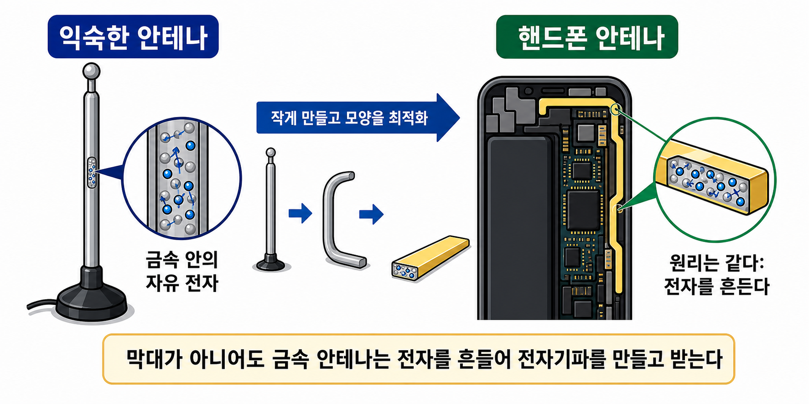
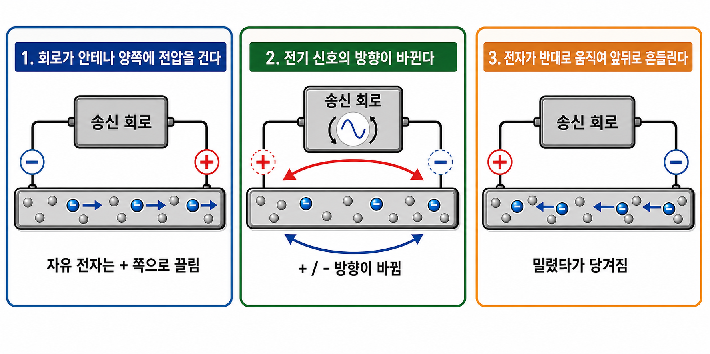

# 목소리는 공중을 날아가지 않는다: 안테나는 어떻게 전자기파를 만들까

## 한 줄 메시지

안테나는 목소리나 카톡 메시지를 공중에 던지는 장치가 아니라, 금속 안의 자유전자를 흔들어 전자기파의 패턴을 만드는 장치다.

## 독자

- 중고등학생을 포함한 비전공 성인
- 핸드폰 통화, 카톡, 와이파이는 익숙하지만 전자기파와 안테나 원리는 낯선 독자

## 도입: 전화 통화할 때 내 목소리는 정말 공중을 날아갈까?

전화 통화를 할 때 우리는 자연스럽게 이렇게 생각하기 쉽다.

내가 말한 목소리가 핸드폰을 통해 공중으로 날아가고, 상대방 핸드폰이 그 목소리를 받아서 다시 들려주는 것 아닐까?

하지만 실제로는 그렇지 않다. 내 목소리의 공기 진동이 그대로 멀리 날아가는 것은 아니다. 핸드폰의 마이크가 먼저 목소리를 전기 신호로 바꾼다. 그다음 핸드폰 내부 회로가 그것을 숫자 데이터로 처리한다. 그리고 그 데이터를 전자기파의 흔들림 패턴으로 바꾸어 보낸다.

상대방 핸드폰은 그 흔들림을 다시 해석해서 목소리로 되돌린다.

즉, 전화 통화에서 공중을 건너가는 것은 내 목소리 자체가 아니다. 공중을 건너가는 것은 내 목소리를 표현하는 전자기파의 패턴이다.

## 손전등 깜빡임처럼, 정보는 패턴으로 표현된다

멀리 떨어진 친구에게 손전등으로 신호를 보낸다고 생각해 보자. 손전등을 한 번 짧게 깜빡이면 `0`, 길게 깜빡이면 `1`이라고 약속할 수 있다.

그러면 손전등 불빛이 글자를 직접 들고 가는 것은 아니지만, 깜빡이는 패턴으로 정보를 보낼 수 있다.

무선 통신도 큰 틀에서는 비슷하다. 핸드폰과 기지국은 손전등 대신 눈에 보이지 않는 전자기파를 사용한다. 그리고 그 전자기파의 세기, 타이밍, 위상 같은 성질을 약속된 방식으로 바꾼다.

이렇게 파동의 모양을 정보에 맞게 바꾸는 일을 어려운 말로 변조라고 한다.

여기서 조심해야 할 점이 있다. 정보는 전자기파 위에 물건처럼 올라타는 것이 아니다. 정보는 전자기파의 흔들림이 어떤 패턴으로 바뀌는지에 표현된다.

## 그럼 안테나는 그 흔들림을 어떻게 만들까?

손전등은 전구를 켜고 끄면서 빛의 패턴을 만든다. 그렇다면 안테나는 무엇을 흔들어서 전자기파의 패턴을 만들까?

출발점은 금속 안의 자유전자다.

안테나는 보통 금속 도체다. 금속 안에는 금속 원자들이 있고, 그 사이에는 비교적 자유롭게 움직일 수 있는 자유전자가 있다.

여기서 자유전자가 안테나 밖으로 날아가는 것은 아니다. 대부분 금속 안에서 아주 짧은 거리만 앞뒤로 움직인다.

위 그림은 개념도다. 왼쪽의 익숙한 막대 안테나와 오른쪽의 휴대폰 내부 안테나는 모양이 다르지만, 둘 다 금속 도체이며 그 안에는 움직일 수 있는 자유전자가 있다는 점을 보여준다.

## 회로가 전압 방향을 바꾸면 자유전자가 흔들린다

자유전자는 그냥 스스로 흔들리지 않는다. 송신 회로가 안테나에 빠르게 바뀌는 전압을 걸어준다.

어느 순간에는 안테나 한쪽이 상대적으로 `+`, 다른 쪽이 `-`가 된다. 자유전자는 음전하이기 때문에 `-` 쪽에서는 밀리고 `+` 쪽으로 끌린다.

그런데 송신 회로는 이 전압 방향을 계속 고정해 두지 않는다. 통신 신호에 맞춰 아주 빠르게 방향을 바꾼다. 그러면 `+`와 `-`의 위치가 바뀌고, 자유전자가 움직이는 방향도 바뀐다.

이 반복 때문에 안테나 속 자유전자는 앞뒤로 조금씩 흔들린다.

이 그림에서 핵심은 `+`와 `-`가 안테나에 저절로 생기는 것이 아니라는 점이다. 송신 회로가 안테나 양쪽에 전압을 걸기 때문에 생긴다. 그리고 그 전압 방향이 빠르게 바뀌기 때문에 자유전자도 앞뒤로 흔들린다.

## 전자의 흔들림이 전기장과 자기장을 흔든다

자유전자가 흔들리면 주변 전기장이 변한다. 전류가 변하면 자기장도 변한다. 이렇게 전기장과 자기장이 함께 흔들리고, 그 흔들림이 안테나 근처에만 머물지 않고 공간으로 퍼져 나가면 전자기파가 된다.

정리하면 이렇다.

`송신 회로의 전압 변화`\n-> `금속 안 자유전자의 흔들림`\n-> `주변 전기장과 자기장의 흔들림`\n-> `공간으로 퍼져 나가는 전자기파`

전자기파는 작은 알갱이가 날아가는 것이 아니다. 공간 속 전기장과 자기장의 변화가 파동처럼 퍼져 나가는 현상이다.

## 소리굽쇠처럼 생각하면 조금 쉽다

이 부분은 소리굽쇠 실험과 비슷하게 생각할 수 있다.

소리굽쇠가 흔들리면 주변 공기가 흔들리고, 그 공기의 흔들림이 소리로 퍼져 나간다. 다른 소리굽쇠나 귀는 그 흔들림에 반응한다.

안테나도 비슷하다. 안테나 속 자유전자가 흔들리면 주변 전기장과 자기장이 흔들리고, 그 흔들림이 전자기파로 퍼져 나간다. 다른 안테나는 그 전자기파에 반응해 다시 약한 전기 신호를 만든다.

다만 차이도 있다. 소리는 공기 같은 매질이 필요하지만, 전자기파는 공기가 없어도 공간을 통해 퍼질 수 있다.

한 문장으로 말하면 이렇다.

> 소리굽쇠는 공기를 흔들고, 안테나는 전기장과 자기장을 흔든다.

## 다음 이야기

안테나가 전자기파를 만드는 출발점은 금속 안의 자유전자를 흔드는 것이다. 그런데 요즘 휴대폰에는 예전처럼 긴 막대 안테나가 보이지 않는다.

다음 편에서는 휴대폰 안테나가 어디에 숨어 있고, 같은 안테나가 어떻게 보내기도 하고 받기도 하는지 살펴본다.
