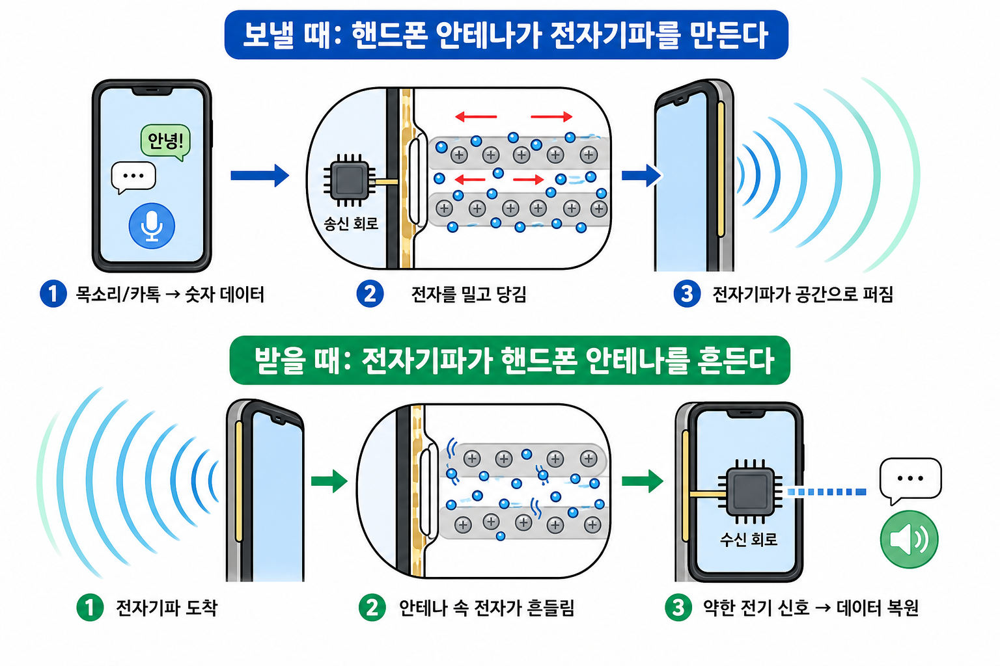
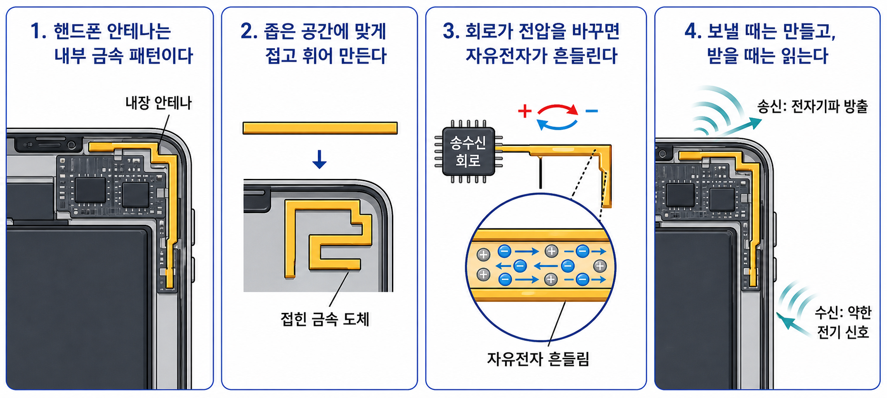

# 휴대폰 안테나는 어디에 숨어 있을까

## 한 줄 메시지

휴대폰 안테나는 보이지 않을 뿐, 내부 금속 구조를 이용해 전자기파를 만들고 읽는다.

## 도입: 왜 요즘 휴대폰에는 안테나가 안 보일까?

옛날 라디오나 자동차 안테나는 바깥으로 길게 튀어나온 막대처럼 보였다. 그런데 요즘 휴대폰에서는 그런 안테나를 보기 어렵다.

그렇다고 휴대폰에 안테나가 없는 것은 아니다. 휴대폰 안테나는 밖으로 튀어나오지 않을 뿐, 내부 가장자리, 금속 프레임, PCB 위의 금속 패턴 같은 형태로 들어간다.

공간이 좁기 때문에 길게 뻗은 막대를 그대로 넣을 수 없다. 그래서 금속 도체를 접고, 휘고, 내부 구조에 맞게 최적화한다.

## 휴대폰 안테나는 보낼 때와 받을 때 반대로 동작한다

휴대폰 안테나는 한 가지 일만 하는 부품이 아니다. 보낼 때와 받을 때 역할이 반대로 바뀐다.

보낼 때는 송신 회로가 안테나 속 자유전자를 흔든다. 이 흔들림이 전자기파로 공간에 퍼져 나간다.

받을 때는 반대다. 공간을 지나온 전자기파가 휴대폰 안테나에 도착하면, 그 흔들림이 안테나 속 자유전자를 아주 조금 흔든다. 그러면 안테나에 아주 약한 전기 신호가 생기고, 수신 회로가 그 신호를 증폭하고 해석한다.

이 그림은 송신과 수신의 방향을 나누어 보여주는 개념도다. 실제 휴대폰 내부 구조는 훨씬 복잡하지만, 보낼 때는 전기 신호가 전자기파가 되고, 받을 때는 전자기파가 약한 전기 신호가 된다는 흐름은 같다.

`보낼 때: 전기 신호 -> 안테나 속 전자 흔들림 -> 전자기파`\n`받을 때: 전자기파 -> 안테나 속 전자 흔들림 -> 전기 신호`

## 휴대폰 안테나는 막대 안테나를 그대로 줄인 것이 아니다

휴대폰 안테나는 보통 내부 금속 패턴, 금속 프레임 일부, 작은 금속판, PCB 패턴, F자형 구조, 루프 구조 등 여러 형태로 구현된다.

어떤 구조는 패치 안테나와 비슷하게 납작한 금속 구조를 쓰기도 하지만, 휴대폰 안테나 전체를 단순히 패치 안테나라고 부르기는 어렵다. 휴대폰은 너무 작고, 손으로 잡히고, 여러 주파수 대역을 처리해야 하기 때문이다.

그래서 휴대폰 안테나는 "작고 복잡한 내장형 안테나 시스템"으로 보는 것이 안전하다.

위 그림은 휴대폰 안테나를 단순화한 개념도다. 실제 휴대폰 안테나는 제조사, 모델, 주파수 대역에 따라 다르게 설계된다.

중요한 점은 모양이 막대가 아니어도 원리가 달라지지 않는다는 것이다. 휴대폰 안테나도 금속 도체이고, 그 안에는 자유전자가 있다. 송수신 회로가 전압과 전류를 바꾸면 자유전자가 흔들리고, 그 흔들림이 전자기파를 만들거나 들어온 전자기파를 약한 전기 신호로 바꾼다.

## 휴대폰 전파는 예쁜 도넛 모양으로 퍼지지 않는다

막대 안테나는 비교적 단순한 도넛 모양의 방사 패턴으로 설명할 수 있다. 하지만 휴대폰 안테나는 그렇게 단순하지 않다.

휴대폰 본체, 접지면, 금속 프레임, 사용자의 손, 사용하는 주파수에 따라 전파가 강한 방향과 약한 방향이 복잡하게 달라진다.

그래서 휴대폰 안테나는 완벽한 옴니 안테나도 아니고, 특정 방향만 강하게 쏘는 섹터 안테나도 아니다. 사용자가 어떻게 들고 있어도 기지국과 연결될 수 있도록 여러 방향으로 신호가 나가게 설계된 복잡한 내장형 안테나 시스템에 가깝다.

## 다음 이야기

휴대폰 안테나는 작고 복잡하지만, 결국 금속 안의 전자를 흔든다는 원리는 같다.

그렇다면 안테나 모양이 바뀌면 전파가 퍼지는 방향도 달라질까? 다음 편에서는 옴니 안테나, 섹터 안테나, 패치 안테나를 통해 안테나의 방향성을 살펴본다.
