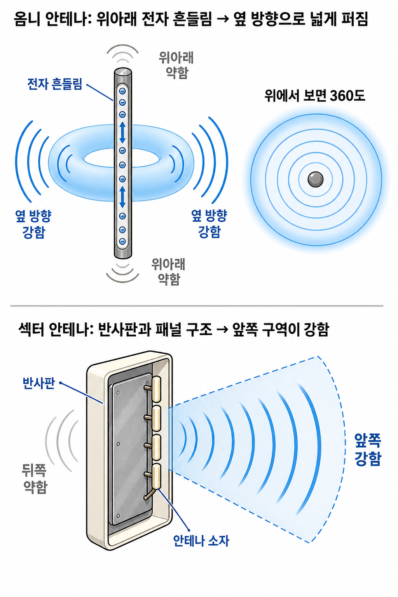
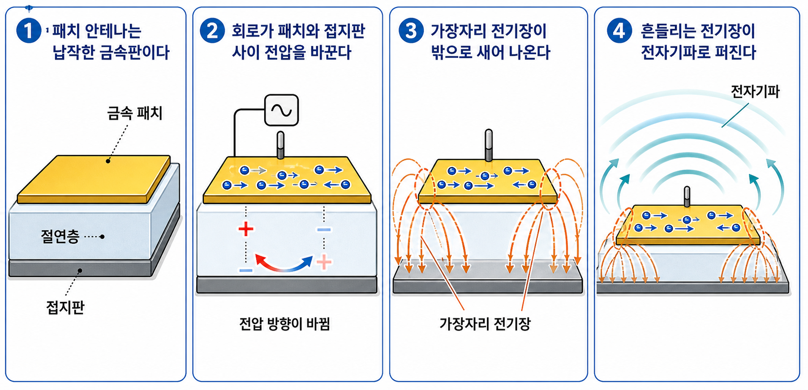

# 전파는 어떻게 멀리 있는 나에게 도달할까

## 한 줄 메시지

전파가 멀리 있는 나에게 도달하는 것은 전자가 날아오기 때문이 아니라, 안테나가 만든 전기장과 자기장의 흔들림이 공간으로 퍼지고, 그 퍼지는 강약을 안테나 구조가 결정하기 때문이다.

## 도입: 멀리 떨어진 핸드폰까지 전파가 어떻게 올까?

기지국 안테나는 내 손에 든 핸드폰과 멀리 떨어져 있다. 그런데도 통화와 카톡은 도착한다. 그렇다면 전파는 어떻게 그 거리까지 퍼져 나와 내 핸드폰 안테나에 닿을까?

출발점은 앞선 글과 같다. 안테나 속 전자가 흔들리면 주변 전기장과 자기장이 흔들리고, 그 흔들림이 전자기파로 공간을 따라 퍼져 나간다.

다만 전파가 모든 방향으로 똑같이 퍼지는 것은 아니다. 안테나의 모양과 구조에 따라 전파가 강한 방향과 약한 방향이 달라진다.

여기서 중요한 점은 전자가 어느 방향으로 날아가기 때문에 방향성이 생기는 것이 아니라는 점이다. 전자는 금속 안에서 짧게 흔들릴 뿐이다. 전파가 강하게 퍼지는 방향은 안테나 구조가 만든다.

## 막대 안테나는 왜 수평 360도로 퍼질까?

막대 안테나는 이해하기 가장 쉬운 안테나다.

막대 안테나에서는 자유전자가 막대 방향으로 위아래 흔들린다. 이 흔들림은 주변의 전기장과 자기장을 흔들고, 그 흔들림이 전자기파로 공간에 퍼져 나간다.

막대 안테나는 구조가 사방으로 대칭이다. 그래서 수평 방향으로는 어느 쪽에서 보아도 비슷하게 전파가 퍼진다. 위에서 내려다보면 안테나를 중심으로 360도 퍼지는 것처럼 보인다.

단, 위아래까지 완전히 같은 세기로 퍼지는 공 모양은 아니다. 옆에서 보면 도넛 모양에 가깝다. 막대의 위아래 방향은 상대적으로 약하고, 막대의 옆 방향은 강하다.

이런 안테나를 옴니 안테나라고 부른다.

## 섹터 안테나는 왜 앞쪽 구역이 강할까?

기지국에서 흔히 보는 납작한 패널 안테나는 옴니 안테나와 다르게 동작한다. 섹터 안테나는 360도 전체에 비슷하게 퍼뜨리는 것이 아니라, 특정 구역을 향해 더 강한 신호를 보내도록 설계된다.

여기서도 전자기파를 만드는 출발점은 같다. 패널 안의 금속 소자나 금속 패치에서 자유전자가 흔들리고, 전기장과 자기장의 흔들림이 만들어진다.

다만 섹터 안테나는 소자 뒤쪽에 반사판이나 접지판 같은 금속 구조를 두고, 여러 소자와 패널 구조를 이용해 방사 패턴을 조절한다. 뒤쪽으로 새는 신호는 줄이고, 앞쪽 특정 구역에서는 신호가 더 강하게 형성되도록 만든다.

쉽게 말하면 옴니 안테나는 방 가운데 켠 전구처럼 주변으로 넓게 퍼뜨리고, 섹터 안테나는 뒤쪽을 막고 앞쪽 구역을 더 밝게 비추는 조명판에 가깝다.

이 그림은 옴니와 섹터의 방향성 차이를 보여주는 개념도다. 옴니는 수평 방향으로 넓게 퍼지고, 섹터는 패널 구조와 반사판 때문에 앞쪽 구역이 강하다.

여기서 빔포밍은 일부러 빼고 생각하는 것이 좋다. 옴니와 섹터의 차이는 안테나의 기본 물리 구조와 방사 패턴 차이다. 빔포밍은 여러 안테나 소자의 신호를 동적으로 조절해 방향을 더 세밀하게 바꾸는 별도의 주제다.

## 패치 안테나는 납작한데 어떻게 전파를 만들까?

섹터 안테나 내부를 뜯어보면 막대처럼 생긴 소자만 있는 것은 아니다. 네모난 금속 패치 형태의 안테나가 들어 있는 경우도 많다.

패치 안테나는 납작한 금속 패치와 그 아래 접지판으로 이루어진 구조다. 회로가 금속 패치와 접지판 사이의 전압을 빠르게 바꾸면, 패치 위의 자유전자와 전류가 흔들린다.

이때 전기장은 패치와 접지판 사이에만 갇혀 있지 않고, 패치 가장자리에서 바깥쪽으로 휘어나온다. 이 가장자리 전기장이 계속 흔들리면 주변 전기장과 자기장도 함께 흔들리고, 그 흔들림이 전자기파로 퍼져 나간다.

이 그림은 패치 안테나의 원리를 단순화한 것이다. 실제 구조는 주파수와 설계 목적에 따라 달라지지만, 납작한 금속판에서도 전압과 전류의 흔들림이 생기고, 특히 가장자리 전기장이 전자기파 방사에 중요한 역할을 한다는 점을 보여준다.

패치 안테나를 한 문장으로 말하면, 금속 패치의 가장자리에서 밖으로 새어 나오는 흔들리는 전기장이 전자기파로 퍼지는 구조다.

## 다음 질문: 수많은 핸드폰은 어떻게 자기 신호만 받을까?

이제 안테나가 전파를 만들고 어느 방향으로 강하게 퍼뜨리는지는 어느 정도 보인다.

그런데 주변에는 핸드폰이 수십 대, 수백 대 있다. 공간에는 여러 전자기파가 섞여 있을 텐데, 내 핸드폰은 어떻게 내 카톡과 내 통화만 골라 받을까?

이 질문은 다음 연재 주제로 넘기는 것이 좋다. 간단히만 말하면, 이동통신 시스템은 시간, 주파수, 코드, 식별자, 암호화 같은 약속을 사용한다. 핸드폰은 아무 전자기파나 다 자기 정보로 읽지 않고, 기지국과 미리 정한 자원과 식별자에 맞는 신호만 골라 해석한다.

## 정리

안테나의 방향성은 전자가 그 방향으로 날아가기 때문에 생기는 것이 아니다. 전자는 금속 안에서 흔들릴 뿐이다.

전파가 어떤 방향으로 강하게 퍼지는지는 안테나의 모양, 반사판, 접지판, 소자 배치가 결정한다.

옴니 안테나는 수평 방향으로 넓게 퍼지고, 섹터 안테나는 앞쪽 구역이 강하며, 패치 안테나는 납작한 금속 구조의 가장자리 전기장을 이용해 전자기파를 만든다.
